# Current Focus Flow Implementation

## Overview
This document captures the actual focus flow implementation in the A4C-FrontEnd medication entry system as of the current codebase state.

## File Locations
- **Main Modal**: `src/views/medication/MedicationEntryModal.tsx`
- **Medication Search**: `src/views/medication/MedicationSearch.tsx`
- **Dosage Form**: `src/views/medication/DosageForm.tsx`
- **Category Selection**: `src/views/medication/CategorySelection.tsx`
- **Date Selection**: `src/views/medication/DateSelection.tsx`
- **View Model**: `src/viewModels/medication/MedicationEntryViewModel.ts`

## Focus Flow Diagram

```mermaid
flowchart TB
    Start([Modal Opens]) --> AutoFocus[Auto-focus: MedicationSearch inputRef<br/>50ms delay]
    
    AutoFocus --> MedSearch[Medication Search Input<br/>ref: inputRef<br/>Auto-opens dropdown on typing]
    
    MedSearch -->|Enter/Tab with results| MedSelect{Select Medication}
    MedSelect -->|Exact match or single highlight| MedSelected[Medication Selected<br/>Triggers: handleMedicationSelect]
    MedSelected --> FocusDosage[Focus Dosage Form<br/>shouldFocusDosageForm = true]
    
    FocusDosage --> DosageCat[Dosage Category Input<br/>ref: categoryInputRef<br/>Auto-focus on mount if focusOnMount=true]
    
    DosageCat -->|Enter/Tab| CatSelect{Select Category}
    CatSelect -->|Single match| CatSelected[Category Selected]
    CatSelected -->|50ms delay| FormType[Form Type Input<br/>ref: formTypeInputRef]
    
    FormType -->|Enter/Tab| TypeSelect{Select Form Type}
    TypeSelect -->|Single match| TypeSelected[Form Type Selected]
    TypeSelected -->|50ms delay| Amount[Dosage Amount Input<br/>ref: amountInputRef]
    
    Amount -->|Enter/Tab| AmountValidate{Validate Number}
    AmountValidate -->|Valid| AmountValid[Amount Valid]
    AmountValidate -->|Invalid| AmountError[Show Error<br/>Prevent focus advance]
    AmountValid -->|50ms delay| Unit[Dosage Unit Input<br/>ref: unitInputRef]
    
    Unit -->|Enter/Tab| UnitSelect{Select Unit}
    UnitSelect -->|Single match| UnitSelected[Unit Selected]
    UnitSelected -->|50ms delay| TotalAmt[Total Amount Input<br/>ref: totalAmountInputRef]
    
    TotalAmt -->|Enter/Tab| TotalValidate{Validate Number}
    TotalValidate -->|Valid| TotalValid[Total Amount Valid]
    TotalValidate -->|Invalid| TotalError[Show Error<br/>Prevent focus advance]
    TotalValid -->|50ms delay| TotalUnit[Total Unit Input<br/>ref: totalUnitInputRef]
    
    TotalUnit -->|Enter/Tab| TotalUnitSelect{Select Total Unit}
    TotalUnitSelect -->|Single match| TotalUnitSelected[Total Unit Selected]
    TotalUnitSelected -->|50ms delay| Freq[Frequency Input<br/>ref: frequencyInputRef]
    
    Freq -->|Enter/Tab| FreqSelect{Select Frequency}
    FreqSelect -->|Single match| FreqSelected[Frequency Selected]
    FreqSelected -->|50ms delay| Cond[Condition Input<br/>ref: conditionInputRef]
    
    Cond -->|Enter/Tab| CondSelect{Select Condition}
    CondSelect -->|Single match| CondSelected[Condition Selected<br/>Calls: onConditionComplete]
    CondSelected -->|50ms delay| BroadCat[Broad Categories Button<br/>id: broad-categories-button<br/>ref: broadCategoriesButtonRef]
    
    BroadCat -->|Focus| AutoOpenBroad[Auto-open Modal<br/>onFocus trigger]
    AutoOpenBroad --> BroadModal[Broad Categories Modal]
    BroadModal -->|Done clicked| BroadDone[Modal Closes]
    BroadDone -->|50ms delay| SpecCat[Specific Categories Button<br/>id: specific-categories-button<br/>ref: specificCategoriesButtonRef]
    
    SpecCat -->|Focus if enabled| AutoOpenSpec[Auto-open Modal<br/>onFocus trigger]
    AutoOpenSpec --> SpecModal[Specific Categories Modal]
    SpecModal -->|Done clicked| SpecDone[Modal Closes]
    SpecDone -->|50ms delay| StartDate[Start Date Button<br/>id: start-date<br/>ref: startDateButtonRef]
    
    StartDate -->|Focus| AutoOpenStart[Auto-open Calendar<br/>onFocus trigger]
    AutoOpenStart --> StartCal[Start Date Calendar Modal]
    StartCal -->|Done/Skip| StartComplete[Calendar Closes<br/>Calls: onStartDateComplete]
    StartComplete -->|50ms delay| DiscDate[Discontinue Date Button<br/>id: discontinue-date<br/>ref: discontinueDateButtonRef]
    
    DiscDate -->|Focus| AutoOpenDisc[Auto-open Calendar<br/>onFocus trigger]
    AutoOpenDisc --> DiscCal[Discontinue Date Calendar Modal]
    DiscCal -->|Done/Skip| DiscComplete[Calendar Closes<br/>Calls: onDiscontinueDateComplete]
    DiscComplete -->|50ms delay| SaveBtn[Save Button<br/>data-testid: medication-save-button]
    
    SaveBtn --> End([Form Complete])
    
    %% Side flows for dropdowns
    DosageCat -.->|onFocus opens dropdown| CatDrop[Category Dropdown<br/>Auto-scroll via onDropdownOpen]
    FormType -.->|onFocus opens dropdown| TypeDrop[Form Type Dropdown<br/>Auto-scroll via onDropdownOpen]
    Unit -.->|onFocus opens dropdown| UnitDrop[Unit Dropdown<br/>Auto-scroll via onDropdownOpen]
    TotalUnit -.->|onFocus opens dropdown| TotalUnitDrop[Total Unit Dropdown<br/>Auto-scroll via onDropdownOpen]
    Freq -.->|onFocus opens dropdown| FreqDrop[Frequency Dropdown<br/>Auto-scroll via onDropdownOpen]
    Cond -.->|onFocus opens dropdown| CondDrop[Condition Dropdown<br/>Auto-scroll via onDropdownOpen]

    classDef inputField fill:#e1f5fe,stroke:#01579b,stroke-width:2px
    classDef buttonField fill:#fff3e0,stroke:#e65100,stroke-width:2px
    classDef modal fill:#f3e5f5,stroke:#4a148c,stroke-width:2px
    classDef validation fill:#ffebee,stroke:#c62828,stroke-width:2px
    
    class MedSearch,DosageCat,FormType,Amount,Unit,TotalAmt,TotalUnit,Freq,Cond inputField
    class BroadCat,SpecCat,StartDate,DiscDate,SaveBtn buttonField
    class BroadModal,SpecModal,StartCal,DiscCal modal
    class AmountError,TotalError validation
```

## Key Implementation Details

### 1. Auto-Focus Mechanisms
- **Initial Focus**: MedicationSearch auto-focuses on mount with 50ms delay (`useEffect` in MedicationSearch.tsx)
- **Modal Auto-Open**: Buttons auto-open their modals/dropdowns on focus:
  - Broad Categories Button (line 63-66 in CategorySelection.tsx)
  - Specific Categories Button (line 86-91 in CategorySelection.tsx)
  - Start Date Button (line 272-278 in DateSelection.tsx)
  - Discontinue Date Button (line 301-307 in DateSelection.tsx)

### 2. Focus Advancement Triggers
- **Enter/Tab Keys**: Most inputs advance focus on Enter or Tab with validation
- **50ms Delays**: All focus transitions use `setTimeout(() => element.focus(), 50)` for reliability
- **Conditional Advancement**: Only advances if selection is made or validation passes

### 3. Validation Points
- **Dosage Amount**: Validates numeric input (regex: `/^\d*\.?\d+$/`)
- **Total Amount**: Validates numeric input (regex: `/^\d*\.?\d+$/`)
- Both prevent focus advancement if validation fails

### 4. Focus Restoration
- **After Modal Close**: Each modal has specific focus target after closing:
  - Broad Categories → Specific Categories Button
  - Specific Categories → Start Date Button
  - Start Date → Discontinue Date Button
  - Discontinue Date → Save Button

### 5. Refs and IDs Used
**Input Refs (DosageForm.tsx):**
- `categoryInputRef` - Dosage category
- `formTypeInputRef` - Form type
- `amountInputRef` - Dosage amount
- `unitInputRef` - Dosage unit
- `totalAmountInputRef` - Total amount
- `totalUnitInputRef` - Total unit
- `frequencyInputRef` - Frequency
- `conditionInputRef` - Condition

**Button Refs (CategorySelection.tsx):**
- `broadCategoriesButtonRef` - Broad categories
- `specificCategoriesButtonRef` - Specific categories

**Button Refs (DateSelection.tsx):**
- `startDateButtonRef` - Start date
- `discontinueDateButtonRef` - Discontinue date

**Element IDs:**
- `broad-categories-button`
- `specific-categories-button`
- `start-date`
- `discontinue-date`

### 6. Auto-Scroll Integration
All dropdowns and modals trigger auto-scroll via `onDropdownOpen` callback which:
1. Receives element ID
2. Uses 100ms delay
3. Calls `scrollWhenVisible(element, { behavior: 'smooth' })`

### 7. Conditional Logic

#### Dropdown Selection Logic
- If single highlighted match → Select it
- Else if single result total → Select it
- Else if Enter pressed → Select first result
- Tab key prevents default to allow focus management

#### Modal State Management
- Start Date Calendar: Tracks `tempStartDate` until Done clicked
- Discontinue Date Calendar: Tracks `tempDiscontinueDate` until Done clicked
- Both support Skip (clears field) and Cancel (no changes)

### 8. Known Complexity Points

1. **Mixed Focus Patterns**: Some fields auto-open on focus (dates, categories) while others require interaction (dosage fields)
2. **Timing Dependencies**: Heavy reliance on 50ms and 100ms timeouts for DOM readiness
3. **Validation Blocking**: Amount fields block all focus advancement on invalid input
4. **No Escape Hatch**: Once in a modal, must click Cancel/Done/Skip - no Escape key handling in sub-modals
5. **Tab Prevention**: Many places prevent default Tab behavior, potentially breaking standard navigation
6. **State Coupling**: Focus flow tightly coupled to ViewModel state (e.g., `shouldFocusDosageForm`)

### 9. Missing Implementation

**SideEffectsSelection.tsx**: 
- File exists in directory listing but not implemented yet
- Would likely follow similar pattern to CategorySelection
- Expected to have "Other" option triggering nested modal (per requirements)

## Testing Considerations

1. **Timing Issues**: 50ms delays may be insufficient on slower systems
2. **Focus Trap**: No explicit focus trap in modals - relies on backdrop click blocking
3. **Keyboard Navigation**: Tab key behavior is overridden in many places
4. **Screen Reader**: ARIA attributes present but focus flow may confuse screen readers
5. **Browser Differences**: setTimeout focus may behave differently across browsers