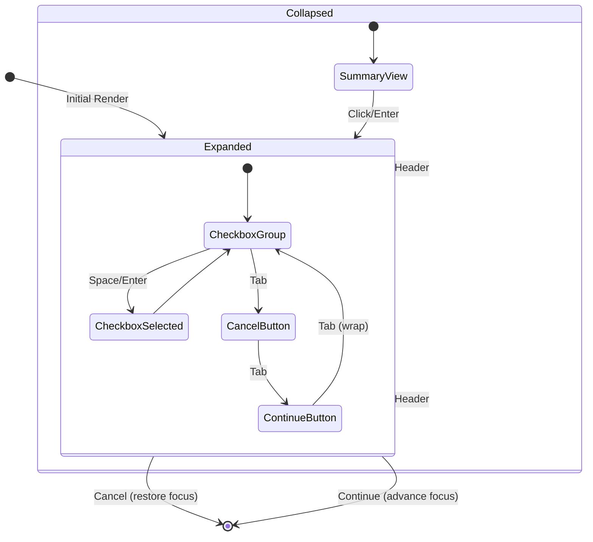

# Focus-Trapped Checkbox Group Component - Implementation Plan

## Executive Summary
Design and implement a reusable, WCAG-compliant focus-trapped checkbox grouping component with edit mode, collapsibility, and glassmorphism styling for use across multiple features in the medication management application.

## Requirements Analysis

### Core Requirements
1. **Focus Trapping**: Component must trap focus within its boundaries until Cancel or Continue
2. **WCAG/ARIA Compliance**: Full WCAG 2.1 Level AA standards for keyboard navigation
3. **Variable Content**: Dynamic checkboxes, labels, and headers configurable per instance
4. **Fixed Buttons**: Cancel (second-to-last tabIndex) and Continue (last tabIndex) always present
5. **Edit Mode**: Collapsible/expandable with summary view when collapsed
6. **Glassmorphism**: Consistent with application's design system
7. **Enhanced Focus Rings**: Must encompass both checkbox and label text

### Discovered Constraints
- Must integrate with existing MobX state management
- Must follow established tabIndex patterns (sequential numbering)
- Must reuse existing hooks and patterns where possible
- Must maintain consistency with MultiSelectDropdown and EditableDropdown patterns

## Architectural Design

### Component Structure
```
/src/components/ui/FocusTrappedCheckboxGroup/
├── index.ts                      # Barrel export
├── FocusTrappedCheckboxGroup.tsx # Main component
├── types.ts                       # TypeScript interfaces
├── CheckboxGroupItem.tsx         # Individual checkbox item
├── CollapsibleHeader.tsx         # Header with expand/collapse
└── hooks/
    └── useFocusTrap.ts           # Custom focus trap logic
```

### Interface Design

```typescript
// types.ts
export interface CheckboxItem {
  id: string;
  label: string;
  disabled?: boolean;
  description?: string;
}

export interface FocusTrappedCheckboxGroupProps {
  // Data
  id: string;
  title: string;
  items: CheckboxItem[];
  selectedIds: string[];
  
  // Handlers
  onSelectionChange: (selectedIds: string[]) => void;
  onCancel: () => void;
  onContinue: (selectedIds: string[]) => void;
  
  // UI Options
  isCollapsible?: boolean;
  initialExpanded?: boolean;
  className?: string;
  
  // TabIndex Management
  baseTabIndex: number;     // Starting tabIndex
  nextTabIndex?: number;    // Where to focus after Continue
  
  // Accessibility
  ariaLabel?: string;
  ariaDescribedBy?: string;
}
```

## Navigation Design

### Keyboard Interaction Model (Hybrid Pattern)

Based on WCAG APG research, implementing a hybrid pattern that balances efficiency with accessibility:

#### Tab Navigation (Between Sections)
- **First Tab**: Enter checkbox group (focus on first/previously selected checkbox)
- **Second Tab**: Focus Cancel button
- **Third Tab**: Focus Continue button
- **Fourth Tab**: Wrap to checkbox group (if focus trapped)

#### Arrow Key Navigation (Within Checkboxes)
- **↑/↓ Arrow Keys**: Navigate between checkboxes
- **Home**: Jump to first checkbox
- **End**: Jump to last checkbox

#### Action Keys
- **Space**: Toggle checkbox selection (primary interaction)
- **Enter**: 
  - On checkbox: Toggle selection
  - On button: Activate button
- **Escape**: Trigger Cancel action (close and restore focus)

### Focus Management Strategy

```typescript
// Pseudo-implementation
const useFocusTrap = (props: FocusTrapProps) => {
  // Leverage existing useKeyboardNavigation hook
  const navigation = useKeyboardNavigation({
    containerRef,
    enabled: isOpen,
    trapFocus: true,
    restoreFocus: true,
    allowTabNavigation: true,
    allowArrowNavigation: true,
    wrapAround: true,
    onEscape: handleCancel
  });
  
  // Custom checkbox group logic
  const handleKeyDown = (e: KeyboardEvent) => {
    if (focusWithinCheckboxes) {
      // Arrow navigation within checkboxes
      if (e.key === 'ArrowDown') {
        focusNextCheckbox();
      } else if (e.key === 'ArrowUp') {
        focusPreviousCheckbox();
      }
    }
    
    // Let useKeyboardNavigation handle Tab navigation
    navigation.handleKeyDown(e);
  };
};
```

## State Management

### Component State Flow



### Selection State Management
- Controlled component pattern (selections managed by parent)
- State persists through collapse/expand cycles
- MobX observable arrays supported

## Visual Design

### Glassmorphism Implementation

```tsx
// Base container styling
const containerClasses = cn(
  "glass-card",                        // Existing glassmorphism class
  "backdrop-blur-md",                  // Blur effect
  "bg-white/90",                       // Semi-transparent background
  "border border-gray-200/50",         // Subtle border
  "shadow-lg",                         // Elevation
  "rounded-lg",                        // Rounded corners
  className
);

// Focus ring styling
const checkboxItemClasses = cn(
  "flex items-center gap-3 px-3 py-2 rounded",
  "transition-all duration-200",
  "hover:bg-blue-50/50",
  "focus-within:ring-2 focus-within:ring-blue-500 focus-within:ring-offset-2",
  "focus-within:bg-blue-50"
);
```

### Edit Mode Appearance

**Expanded State:**
```
┌─────────────────────────────────────┐
│ ▼ Dosage Timing                     │
├─────────────────────────────────────┤
│ ☐ Every X Hours - QxH               │
│ ☑ Every Morning - QAM               │
│ ☐ Every Evening - QPM               │
│ ☐ Every Night at Bedtime - QHS      │
├─────────────────────────────────────┤
│ [Cancel]            [Continue]      │
└─────────────────────────────────────┘
```

**Collapsed State:**
```
┌─────────────────────────────────────┐
│ ▶ Dosage Timing (1 selected)        │
└─────────────────────────────────────┘
```

## Code Reusability Analysis

### From Existing Components

#### MultiSelectDropdown (Reusable Patterns)
- Checkbox rendering with Checkbox component
- Arrow key navigation logic
- Focus management with refs
- Click outside handling
- Observable array handling

#### EditableDropdown (Reusable Patterns)
- Edit mode toggle pattern
- Blur handling with useDropdownBlur
- Focus advancement with useFocusAdvancement
- Collapsed/expanded state management

#### useKeyboardNavigation Hook (Direct Reuse)
- Focus trap implementation
- Tab navigation handling
- Focus restoration
- Escape key handling

### New Implementations Required
1. Checkbox group-specific arrow navigation
2. Fixed tabIndex assignment for buttons
3. Summary view generation for collapsed state
4. Focus ring styling encompassing checkbox + label

## Implementation Phases

### Phase 1: Foundation (2 hours)
- Create component file structure
- Define TypeScript interfaces
- Implement basic component rendering
- Add MobX observer wrapper

### Phase 2: Focus Management (2 hours)
- Integrate useKeyboardNavigation hook
- Implement custom useFocusTrap hook
- Add keyboard event handlers
- Test focus trap boundaries

### Phase 3: Edit Mode (1.5 hours)
- Add collapsible functionality
- Create summary view
- Implement state persistence
- Add smooth transitions

### Phase 4: Styling (1.5 hours)
- Apply glassmorphism effects
- Implement enhanced focus rings
- Add hover states
- Ensure responsive design

### Phase 5: Testing (1 hour)
- Unit tests for focus trap
- E2E tests for keyboard navigation
- Accessibility audit
- Cross-browser testing

## Example Implementation

```tsx
// Usage in MedicationManagementPage.tsx
<FocusTrappedCheckboxGroup
  id="dosage-timing"
  title="Dosage Timing"
  items={[
    { id: 'qxh', label: 'Every X Hours - QxH' },
    { id: 'qam', label: 'Every Morning - QAM' },
    { id: 'qpm', label: 'Every Evening - QPM' },
    { id: 'qhs', label: 'Every Night at Bedtime - QHS' }
  ]}
  selectedIds={vm.selectedTimings}
  onSelectionChange={(ids) => vm.setSelectedTimings(ids)}
  onCancel={() => {
    vm.clearSelectedTimings();
    setShowTimingSelector(false);
  }}
  onContinue={(ids) => {
    vm.confirmSelectedTimings(ids);
    setShowTimingSelector(false);
  }}
  baseTabIndex={23}
  nextTabIndex={30}
  isCollapsible={true}
  initialExpanded={!vm.hasSelectedTimings}
/>
```

## Risk Mitigation

### Identified Risks & Mitigations

1. **Focus Loss in Complex Forms**
   - Risk: Focus might escape in edge cases
   - Mitigation: Comprehensive event.preventDefault() on Tab at boundaries

2. **Browser Inconsistencies**
   - Risk: Focus behavior varies across browsers
   - Mitigation: Use battle-tested useKeyboardNavigation hook

3. **Performance with Many Checkboxes**
   - Risk: Lag with 50+ items
   - Mitigation: Virtual scrolling if needed

4. **Screen Reader Compatibility**
   - Risk: Poor screen reader experience
   - Mitigation: Comprehensive ARIA attributes and testing

## Success Metrics

- [ ] Full keyboard navigation without mouse
- [ ] Focus trap prevents escape except via buttons
- [ ] WCAG 2.1 Level AA compliant
- [ ] Reusable across 3+ different features
- [ ] <50ms render time for 100 items
- [ ] Works with NVDA and VoiceOver
- [ ] Maintains selection through collapse/expand
- [ ] Glassmorphism matches existing UI

## Recommendations

1. **Start with Phase 1-2** to establish core functionality
2. **Test early with screen readers** to catch accessibility issues
3. **Create Storybook story** for isolated development/testing
4. **Document keyboard shortcuts** in component JSDoc
5. **Consider adding animation** for collapse/expand transitions

## Decision Record

### Context
Need a reusable, accessible checkbox group component with focus trapping for multi-select operations in forms.

### Decision
Implement a hybrid navigation pattern combining Tab navigation between component sections and arrow key navigation within checkboxes, leveraging existing dropdown patterns while adding focus trap functionality.

### Rationale
- Balances simplicity with accessibility requirements
- Reuses proven patterns from existing components
- Provides flexibility for different use cases
- Maintains consistency with application's interaction patterns

### Consequences
- **Positive**: Highly accessible, reusable component
- **Positive**: Consistent with existing UX patterns
- **Negative**: Slightly more complex than simple checkbox list
- **Negative**: Requires thorough testing across browsers

## Appendix: WCAG Compliance Checklist

### Keyboard Navigation (2.1.1, 2.1.2)
- [ ] All functionality available via keyboard
- [ ] No keyboard traps (except intentional focus trap)
- [ ] Tab order is logical and predictable
- [ ] Focus visible at all times

### Focus Management (2.4.3, 2.4.7)
- [ ] Focus order follows visual layout
- [ ] Focus indicators are clearly visible
- [ ] Focus restored when component closes
- [ ] Focus trapped when component is modal

### ARIA Implementation (4.1.2)
- [ ] role="group" on container
- [ ] aria-labelledby points to header
- [ ] aria-expanded for collapsible state
- [ ] aria-checked for checkbox states
- [ ] aria-describedby for descriptions

### Screen Reader Support (1.3.1)
- [ ] All content accessible to screen readers
- [ ] State changes announced
- [ ] Instructions available
- [ ] Labels properly associated

### Visual Design (1.4.3, 1.4.11)
- [ ] 4.5:1 contrast for normal text
- [ ] 3:1 contrast for UI components
- [ ] Focus indicators meet contrast requirements
- [ ] Hover states clearly visible