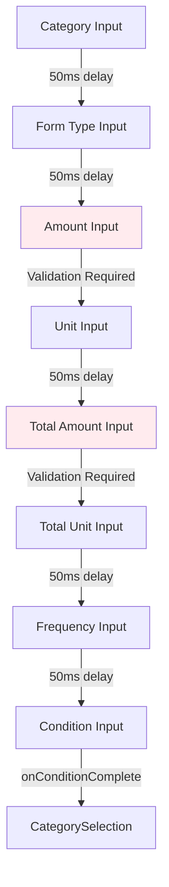

# DosageForm Component Analysis - Task 009

## Problem Analysis

### Component Overview
**File Location**: `/home/lars/dev/A4C-FrontEnd/src/views/medication/DosageForm.tsx`
**Lines of Code**: 673
**Complexity Score**: 8/10 (High complexity)

### Functional Requirements
1. **Multi-field Form Management**: 8 interdependent input fields with dropdown selection
2. **Validation Blocking**: Amount fields require numeric validation before focus advancement
3. **Conditional Enablement**: Fields enable based on prior field completion
4. **Auto-selection Logic**: Tab/Enter keys auto-select when single match exists
5. **Focus Flow Control**: Sequential focus advancement through all 8 fields
6. **Dropdown Management**: Each field has associated dropdown with highlighting

### Non-Functional Requirements
- **Performance**: Focus transitions must be smooth (<100ms)
- **Accessibility**: ARIA attributes for screen reader support
- **Usability**: Predictable keyboard navigation
- **Maintainability**: Clean separation of concerns

## Research Summary

### Current Implementation Analysis

#### All 8 Input Refs Mapped
```typescript
1. categoryInputRef      (line 87)  - Dosage Form Category
2. formTypeInputRef      (line 89)  - Form Type
3. amountInputRef        (line 92)  - Dosage Amount
4. unitInputRef          (line 94)  - Dosage Unit  
5. totalAmountInputRef   (line 95)  - Total Amount
6. totalUnitInputRef     (line 97)  - Total Unit
7. frequencyInputRef     (line 99)  - Frequency
8. conditionInputRef     (line 101) - Condition
```

#### Container Refs for Dropdown Positioning
```typescript
- categoryInputContainerRef   (line 86)
- formTypeInputContainerRef   (line 88)
- unitInputContainerRef        (line 93)
- totalUnitInputContainerRef  (line 96)
- frequencyInputContainerRef  (line 98)
- conditionInputContainerRef  (line 100)
```

### Validation Blocking Logic Documented

#### Amount Field Validation (Lines 347-365)
```typescript
onKeyDown={(e) => {
  if ((e.key === 'Enter' || e.key === 'Tab') && dosageAmount) {
    const isValidNumber = /^\d*\.?\d+$/.test(dosageAmount.trim());
    if (isValidNumber) {
      setAmountValidationError(false);
      if (e.key === 'Tab') {
        return; // Allow natural tab
      }
      e.preventDefault();
      setTimeout(() => unitInputRef.current?.focus(), 50);
    } else {
      e.preventDefault(); // Block advancement
      setAmountValidationError(true);
    }
  }
}}
```

**Validation Pattern**: `/^\d*\.?\d+$/` (decimal numbers)
**Blocking Behavior**: Prevents Tab/Enter advancement on invalid input
**Error State**: Visual feedback with red border and error message

#### Total Amount Validation (Lines 461-479)
Identical pattern to Amount field validation
- Same regex validation
- Same blocking behavior
- Separate error state tracking

### Condition-Based Completion Identified

#### Field Enablement Dependencies
```typescript
1. Category → enables Form Type (line 286: disabled={!dosageFormCategory})
2. Form Type → enables Amount (implicitly through flow)
3. Form Type → enables Unit (line 416: disabled={!dosageFormType})
4. Form Type → enables Total Unit (line 531: disabled={!dosageFormType})
5. All fields → enable Frequency (line 591: disabled={!!frequency})
6. All fields → enable Condition (line 648: disabled={!!condition})
```

#### Completion Callback Chain
```typescript
- onConditionComplete (lines 640-642, 661-663)
  → Triggers focus to CategorySelection (lines 152-158 in MedicationEntryModal)
```

### Amount Field Special Handling

#### Dosage Amount (Lines 331-379)
**Special Features**:
1. **Real-time Validation**: Clears error on valid input (lines 340-345)
2. **Tab Behavior Override**: Allows natural Tab on valid input (lines 353-356)
3. **Error Prevention**: Blocks advancement on invalid number (lines 361-364)
4. **Visual Feedback**: Blue highlight on valid, red on error (line 368-369)

#### Total Amount (Lines 445-493)
**Identical Special Handling**:
- Same validation pattern
- Same error clearing logic
- Same Tab behavior
- Same visual feedback

### Field Dependency Map



## Recommended Solution

### Architecture Overview

```typescript
// Contract Definition for DosageForm Migration
interface DosageFormContract {
  // Preconditions
  preconditions: {
    selectedMedication: boolean; // Must have medication selected
    focusManagerAvailable: boolean; // FocusManager context must exist
  };
  
  // Postconditions
  postconditions: {
    allFieldsWrapped: boolean; // All 8 fields use FocusableField
    validationPreserved: boolean; // Amount validation still blocks
    flowMaintained: boolean; // Sequential flow preserved
    dropdownsFunctional: boolean; // All dropdowns work
  };
  
  // Invariants
  invariants: {
    fieldOrder: number[]; // [1,2,3,4,5,6,7,8] order maintained
    validationRules: RegExp; // /^\d*\.?\d+$/ unchanged
    completionCallbacks: boolean; // All callbacks preserved
  };
  
  // Performance Guarantees
  performance: {
    focusTransition: '<50ms'; // Remove setTimeout delays
    dropdownResponse: '<100ms'; // Dropdown open time
    validationCheck: '<10ms'; // Validation execution time
  };
}
```

## Component Specifications

### Field Configuration Matrix

| Field | Order | Validation | Auto-Select | Dropdown | Completion Callback |
|-------|-------|------------|-------------|----------|-------------------|
| Category | 1 | None | Yes | Yes | onCategoryComplete |
| Form Type | 2 | None | Yes | Yes | onFormTypeComplete |
| Amount | 3 | Numeric | N/A | No | onAmountComplete |
| Unit | 4 | None | Yes | Yes | onUnitComplete |
| Total Amount | 5 | Numeric | N/A | No | onTotalAmountComplete |
| Total Unit | 6 | None | Yes | Yes | onTotalUnitComplete |
| Frequency | 7 | None | Yes | Yes | onFrequencyComplete |
| Condition | 8 | None | Yes | Yes | onConditionComplete |

### Validation Specifications

```typescript
class AmountValidator {
  private readonly pattern = /^\d*\.?\d+$/;
  
  canLeaveFocus = (value: string): boolean => {
    if (!value) return true; // Allow empty to skip
    return this.pattern.test(value.trim());
  };
  
  getErrorMessage = (): string => {
    return 'Please enter a valid number';
  };
  
  shouldBlockTab = (value: string): boolean => {
    return value !== '' && !this.canLeaveFocus(value);
  };
}
```

## Implementation Plan

### Phase 1: Wrapper Implementation
1. Create 8 FocusableField wrappers
2. Configure order attributes (1-8)
3. Set scope to "dosage-form"
4. Preserve existing refs for compatibility

### Phase 2: Validation Migration
1. Convert amount validation to validators
2. Implement canLeaveFocus for blocking
3. Add error state management
4. Preserve visual feedback

### Phase 3: Dropdown Integration
1. Maintain dropdown state management
2. Convert setTimeout delays to FocusManager
3. Preserve auto-selection logic
4. Keep highlighting functionality

### Phase 4: Completion Callbacks
1. Map all 9 completion callbacks
2. Integrate with FocusManager flow
3. Remove manual focus() calls
4. Test field-to-field transitions

## Risk Assessment

### High Risk Areas
1. **Amount Field Validation**: Complex blocking logic with Tab override
2. **Dropdown Auto-Selection**: 6 fields with identical but complex logic
3. **Completion Callbacks**: 9 different callbacks to preserve
4. **Field Dependencies**: Conditional enablement must be maintained

### Medium Risk Areas
1. **setTimeout Delays**: 16 instances to remove (8 fields × 2 delays each)
2. **Container Refs**: Used for dropdown positioning
3. **Error State Management**: Two separate validation error states
4. **Visual Feedback**: Blue/red highlighting based on state

### Mitigation Strategies
1. **Incremental Migration**: Migrate one field at a time
2. **Parallel Implementation**: Keep old logic while adding new
3. **Comprehensive Testing**: Test each field individually
4. **Rollback Plan**: Feature flag for quick reversion

## Decision Record

### ADR-009: DosageForm Migration Strategy

**Context**: DosageForm has 8 interdependent fields with complex validation and dropdown logic

**Decision**: Implement phased migration with validation-first approach

**Alternatives Considered**:
1. Complete rewrite (rejected - too risky)
2. Field-by-field migration (selected - safer)
3. Keep as-is (rejected - technical debt)

**Rationale**: 
- Field-by-field allows testing at each step
- Validation is most critical to preserve
- Dropdown logic can be simplified incrementally

**Consequences**:
- Positive: Lower risk, easier testing
- Negative: Longer migration timeline
- Trade-off: Temporary dual logic during migration

## Migration Checklist for Task 010

### Pre-Migration
- [ ] Review this analysis document
- [ ] Set up feature flag for DosageForm
- [ ] Create backup of current implementation
- [ ] Write comprehensive tests for current behavior

### Field Migration (8 fields)
- [ ] Wrap Category field with FocusableField
- [ ] Wrap Form Type field with FocusableField
- [ ] Wrap Amount field with validation logic
- [ ] Wrap Unit field with FocusableField
- [ ] Wrap Total Amount field with validation logic
- [ ] Wrap Total Unit field with FocusableField
- [ ] Wrap Frequency field with FocusableField
- [ ] Wrap Condition field with FocusableField

### Validation Migration
- [ ] Convert Amount validation to validator
- [ ] Convert Total Amount validation to validator
- [ ] Test blocking behavior preserved
- [ ] Verify error states work

### Dropdown Migration (6 dropdowns)
- [ ] Migrate Category dropdown logic
- [ ] Migrate Form Type dropdown logic
- [ ] Migrate Unit dropdown logic
- [ ] Migrate Total Unit dropdown logic
- [ ] Migrate Frequency dropdown logic
- [ ] Migrate Condition dropdown logic

### Focus Flow Migration
- [ ] Remove all setTimeout delays (16 instances)
- [ ] Remove manual focus() calls (8 instances)
- [ ] Configure field ordering
- [ ] Test complete flow

### Completion Callbacks
- [ ] Map onCategoryComplete
- [ ] Map onFormTypeComplete
- [ ] Map onAmountComplete
- [ ] Map onUnitComplete
- [ ] Map onTotalAmountComplete
- [ ] Map onTotalUnitComplete
- [ ] Map onFrequencyComplete
- [ ] Map onConditionComplete
- [ ] Test CategorySelection transition

### Testing
- [ ] Unit tests for each field
- [ ] Integration test for complete flow
- [ ] Validation blocking tests
- [ ] Dropdown selection tests
- [ ] Keyboard navigation tests
- [ ] Screen reader compatibility

### Cleanup
- [ ] Remove old focus logic
- [ ] Remove setTimeout instances
- [ ] Clean up unused refs
- [ ] Update documentation

## Complexity Score Calculation

### Metrics
1. **Component Count**: 8 fields + 6 dropdowns = 14 (Score: 4/5)
2. **Integration Complexity**: High coupling with parent (Score: 4/5)
3. **Technology Diversity**: React + MobX + Focus logic (Score: 3/5)
4. **Configuration Complexity**: 49 props, 9 callbacks (Score: 5/5)
5. **Operational Overhead**: Complex validation + dropdowns (Score: 4/5)

**Total Complexity Score**: 8/10 (High Complexity)

### Comparison with MedicationSearch (Task 007)
- **MedicationSearch**: 7/10 complexity
- **DosageForm**: 8/10 complexity
- **Reason**: More fields, more validation points, more callbacks

## Success Metrics

### Quantitative
- Focus transitions: <50ms (currently 50ms setTimeout)
- Validation execution: <10ms
- Dropdown response: <100ms
- Test coverage: >95%

### Qualitative
- All validations work identically
- Dropdown behavior unchanged
- Keyboard navigation preserved
- No visual regressions

## Conclusion

DosageForm represents the most complex component in the medication entry system with:
- 8 interdependent fields
- 2 validation blocking points
- 6 dropdown selections
- 9 completion callbacks
- 16 setTimeout delays to remove

The migration requires careful attention to:
1. Preserving validation blocking behavior
2. Maintaining dropdown auto-selection
3. Keeping field dependencies intact
4. Ensuring completion callbacks fire correctly

Recommended approach: Field-by-field migration with comprehensive testing at each step.