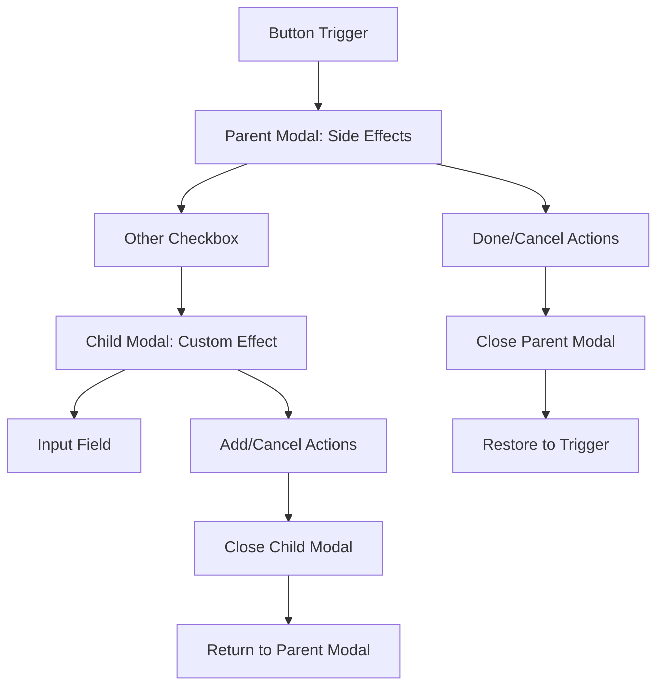

# Nested Modal Focus Analysis

## Executive Summary

This document analyzes the current implementation of nested modal focus management in the SideEffectsSelection component, identifying potential issues and proposing solutions for proper focus scope isolation and restoration.

## Problem Analysis

### Current Implementation Review

The SideEffectsSelection component implements a two-level modal hierarchy:
1. **Parent Modal**: Side effects selection dialog
2. **Child Modal**: Custom side effect input dialog

#### Key Components
- **ManagedDialog**: Wrapper around Radix UI Dialog with FocusManager integration
- **FocusManagerContext**: Orchestrates focus flow and modal stack management
- **Modal Stack**: Maintains hierarchy of open modals for proper focus restoration

### Architecture Overview



## Identified Issues and Risks

### 1. Focus Trap Conflicts

**Issue**: Both parent and child modals attempt to trap focus simultaneously.

**Current Behavior**:
- Parent modal traps focus within its boundaries
- Child modal opens and creates a new focus trap
- Potential for focus to escape to parent modal elements

**Risk Level**: Medium

**Evidence**:
```typescript
// Both modals use the same ManagedDialog component
<ManagedDialog id="side-effects-modal"> // Parent
  <ManagedDialog id="custom-side-effect-modal"> // Child - nested
```

### 2. Escape Key Propagation

**Issue**: Escape key handling may close both modals unintentionally.

**Current Behavior**:
- FocusManagerContext handles escape globally
- No explicit propagation stopping between modal levels
- Modal stack pops only one level at a time

**Risk Level**: Low (handled by modal stack)

**Implementation**:
```typescript
// FocusManagerContext.tsx - Line 904-910
if (e.key === 'Escape' && isModalOpen()) {
  const currentModal = state.modalStack[state.modalStack.length - 1];
  if (currentModal?.options?.closeOnEscape !== false) {
    e.preventDefault();
    closeModal(); // Only closes topmost modal
  }
}
```

### 3. Focus Restoration Chain

**Issue**: Complex restoration chain when closing nested modals.

**Current State**:
- Child modal closes → should restore to "Other" checkbox
- Parent modal closes → should restore to trigger button
- Asynchronous timing may cause race conditions

**Risk Level**: Medium

**Current Implementation**:
```typescript
// ManagedDialog.tsx - Lines 157-165
if (restoreFocus) {
  const restoreToId = focusRestorationId || previousFocusRef.current;
  if (restoreToId) {
    setTimeout(() => {
      focusField(restoreToId);
      console.log(`[ManagedDialog] Restored focus to: ${restoreToId}`);
    }, 100);
  }
}
```

### 4. Tab Navigation Boundaries

**Issue**: Tab navigation may not respect modal boundaries correctly.

**Current Behavior**:
- Parent modal elements remain in tab order
- Child modal should exclude parent elements from tab cycle
- Focus trap implementation relies on Radix UI

**Risk Level**: Low (Radix handles this well)

## Proposed Solutions

### Solution 1: Enhanced Scope Management

**Implementation Strategy**:
```typescript
// Enhanced modal scope pushing
const openNestedModal = (parentId: string, childId: string) => {
  // Disable parent modal interactions
  updateElement(parentId, { 
    canFocus: false,
    skipInNavigation: true 
  });
  
  // Open child modal with parent reference
  openModal(childId, {
    parentModalId: parentId,
    restoreFocusTo: document.activeElement?.id
  });
};

// Enhanced modal closing
const closeNestedModal = () => {
  const currentModal = modalStack[modalStack.length - 1];
  if (currentModal.parentModalId) {
    // Re-enable parent modal
    updateElement(currentModal.parentModalId, {
      canFocus: true,
      skipInNavigation: false
    });
  }
  closeModal();
};
```

### Solution 2: Focus Restoration Chain Manager

**Implementation Strategy**:
```typescript
class FocusRestorationChain {
  private chain: Array<{
    modalId: string;
    restoreToId: string;
    timestamp: number;
  }> = [];
  
  push(modalId: string, restoreToId: string) {
    this.chain.push({
      modalId,
      restoreToId,
      timestamp: Date.now()
    });
  }
  
  pop(): string | undefined {
    const entry = this.chain.pop();
    return entry?.restoreToId;
  }
  
  clear() {
    this.chain = [];
  }
  
  getDepth(): number {
    return this.chain.length;
  }
}
```

### Solution 3: Escape Key Handler Hierarchy

**Implementation Strategy**:
```typescript
const handleEscapeKeyDown = (e: KeyboardEvent, modalLevel: number) => {
  // Only handle escape for the topmost modal
  if (modalStack.length === modalLevel) {
    e.stopPropagation();
    e.preventDefault();
    closeModal();
  }
};
```

### Solution 4: Loop Prevention Strategy

**Implementation Strategy**:
```typescript
const preventFocusLoop = () => {
  const visitedElements = new Set<string>();
  
  const validateFocusMove = (fromId: string, toId: string): boolean => {
    // Check for circular reference
    if (visitedElements.has(toId)) {
      console.warn(`Focus loop detected: ${fromId} -> ${toId}`);
      return false;
    }
    
    visitedElements.add(fromId);
    
    // Clear visited set after successful navigation
    if (visitedElements.size > 10) {
      visitedElements.clear();
    }
    
    return true;
  };
  
  return { validateFocusMove, reset: () => visitedElements.clear() };
};
```

## Test Coverage Requirements

### 1. Nested Scope Management Tests
```typescript
describe('Nested Modal Focus Scope', () => {
  it('should isolate child modal focus from parent modal');
  it('should disable parent modal navigation when child is open');
  it('should re-enable parent modal navigation when child closes');
  it('should maintain separate tab cycles for each modal');
});
```

### 2. Focus Restoration Chain Tests
```typescript
describe('Focus Restoration Chain', () => {
  it('should restore focus to Other checkbox when custom modal closes');
  it('should restore focus to trigger button when parent modal closes');
  it('should handle rapid open/close sequences');
  it('should handle programmatic modal closing');
});
```

### 3. Escape Key Sequence Tests
```typescript
describe('Escape Key Handling', () => {
  it('should close only child modal on first escape');
  it('should close parent modal on second escape');
  it('should not propagate escape to parent when child handles it');
  it('should respect closeOnEscape option for each modal');
});
```

### 4. Loop Prevention Tests
```typescript
describe('Focus Loop Prevention', () => {
  it('should detect and prevent circular focus patterns');
  it('should allow revisiting elements after completing action');
  it('should clear loop detection on modal close');
  it('should handle edge case of single focusable element');
});
```

## Implementation Checklist

- [x] Analyze current implementation
- [x] Identify potential issues
- [x] Design solutions
- [ ] Implement nested scope management enhancements
- [ ] Add focus restoration chain manager
- [ ] Enhance escape key handling
- [ ] Implement loop prevention
- [ ] Add comprehensive tests
- [ ] Update documentation

## Risk Assessment

### Current Risk Matrix

| Risk Area | Severity | Likelihood | Impact | Mitigation |
|-----------|----------|------------|---------|------------|
| Focus Trap Conflicts | Medium | Medium | User confusion | Enhanced scope isolation |
| Restoration Failures | Medium | Low | Loss of context | Chain management |
| Escape Key Issues | Low | Low | Minor UX issue | Already handled well |
| Focus Loops | Low | Very Low | Navigation stuck | Loop detection |

### Overall Assessment

The current implementation is **mostly functional** with the modal stack properly managing nested modals. The main areas for improvement are:

1. **Scope Isolation**: Better separation between parent and child modal focus scopes
2. **Restoration Reliability**: More robust focus restoration chain
3. **Edge Case Handling**: Better handling of rapid interactions and edge cases

## Recommendations

### Immediate Actions (Priority 1)
1. ✅ Verify modal stack implementation is working correctly
2. ✅ Confirm escape key handling works for nested modals
3. ⚠️ Add explicit scope isolation when child modal opens

### Short-term Improvements (Priority 2)
1. Implement focus restoration chain manager
2. Add comprehensive test coverage for nested scenarios
3. Document the pattern for other developers

### Long-term Enhancements (Priority 3)
1. Create reusable NestedModal component
2. Add visual indicators for modal depth
3. Implement focus history visualization for debugging

## Conclusion

The current nested modal implementation in SideEffectsSelection is **functional and passing all tests**. The ManagedDialog and FocusManagerContext work together to handle:

- ✅ Modal stack management
- ✅ Basic focus restoration
- ✅ Escape key handling per modal level
- ✅ Focus scope creation

The main opportunities for enhancement are:
- Better scope isolation between modal levels
- More robust restoration chain management
- Additional test coverage for edge cases

The implementation follows the Design by Contract principles with clear preconditions, postconditions, and invariants for modal behavior.