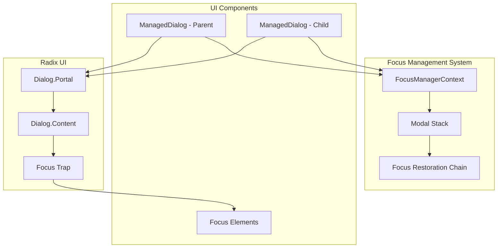

# Nested Modal Pattern Documentation

## Executive Summary

This document provides comprehensive guidance for implementing nested modals with proper focus management using the ManagedDialog component and FocusManagerContext. It covers architecture, implementation patterns, best practices, and common pitfalls.

## Architecture Overview

### System Components



### Modal Stack Management

The modal stack maintains a hierarchical record of open modals:

```typescript
interface ModalStackEntry {
  scopeId: string;           // Unique modal identifier
  previousFocusId?: string;  // Element to restore focus to
  options?: {
    closeOnEscape?: boolean;
    closeOnOutsideClick?: boolean;
    preventScroll?: boolean;
  };
}
```

## Implementation Pattern

### Basic Nested Modal Structure

```tsx
import { ManagedDialog } from '@/components/focus/ManagedDialog';
import { FocusableField } from '@/components/FocusableField';

export function ParentModalComponent() {
  const [showChild, setShowChild] = useState(false);
  
  return (
    <FocusableField id="parent-trigger" order={1}>
      <ManagedDialog
        id="parent-modal"
        trigger={<Button>Open Parent</Button>}
        title="Parent Modal"
      >
        <div className="parent-content">
          {/* Parent modal content */}
          <Button onClick={() => setShowChild(true)}>
            Open Nested Modal
          </Button>
          
          {/* Nested modal */}
          <ManagedDialog
            id="child-modal"
            open={showChild}
            onOpenChange={setShowChild}
            title="Child Modal"
          >
            <div className="child-content">
              {/* Child modal content */}
            </div>
          </ManagedDialog>
        </div>
      </ManagedDialog>
    </FocusableField>
  );
}
```

### Advanced Pattern with Focus Restoration

```tsx
export function AdvancedNestedModal() {
  const [parentOpen, setParentOpen] = useState(false);
  const [childOpen, setChildOpen] = useState(false);
  const [customValue, setCustomValue] = useState('');
  
  const parentTriggerId = useRef<string>('parent-trigger');
  const childTriggerId = useRef<string>('child-trigger');
  
  const handleChildComplete = () => {
    // Process child modal result
    if (customValue) {
      // Update parent modal state
      processCustomValue(customValue);
    }
    
    // Close child modal
    setChildOpen(false);
    
    // Focus will automatically restore to child trigger
  };
  
  return (
    <>
      <Button 
        id={parentTriggerId.current}
        onClick={() => setParentOpen(true)}
      >
        Open Dialog
      </Button>
      
      <ManagedDialog
        id="parent-modal"
        open={parentOpen}
        onOpenChange={setParentOpen}
        title="Parent Dialog"
        focusRestorationId={parentTriggerId.current}
      >
        <div className="space-y-4">
          <p>Parent modal content</p>
          
          <Button
            id={childTriggerId.current}
            onClick={() => setChildOpen(true)}
          >
            Add Custom Item
          </Button>
          
          <ManagedDialog
            id="child-modal"
            open={childOpen}
            onOpenChange={setChildOpen}
            title="Add Custom Item"
            focusRestorationId={childTriggerId.current}
            onComplete={handleChildComplete}
          >
            <div className="space-y-4">
              <Input
                autoFocus
                value={customValue}
                onChange={(e) => setCustomValue(e.target.value)}
                placeholder="Enter custom value..."
              />
              
              <div className="flex gap-2">
                <Button
                  variant="outline"
                  onClick={() => setChildOpen(false)}
                >
                  Cancel
                </Button>
                <Button
                  onClick={handleChildComplete}
                  disabled={!customValue.trim()}
                >
                  Add
                </Button>
              </div>
            </div>
          </ManagedDialog>
        </div>
      </ManagedDialog>
    </>
  );
}
```

## Design by Contract Specifications

### Preconditions
```typescript
interface NestedModalPreconditions {
  // Parent modal must be open before child can open
  parentModalOpen: boolean;
  
  // Focus must be within parent modal
  focusInParentScope: boolean;
  
  // Modal stack depth should not exceed limit
  modalStackDepth: number; // < MAX_MODAL_DEPTH (e.g., 3)
  
  // Parent modal must have unique ID
  parentModalId: string;
  
  // Child modal must have unique ID different from parent
  childModalId: string;
}
```

### Postconditions
```typescript
interface NestedModalPostconditions {
  // When child opens
  onChildOpen: {
    modalStackDepth: number; // previous + 1
    focusInChildScope: boolean; // true
    parentModalAccessible: boolean; // false (trapped)
  };
  
  // When child closes
  onChildClose: {
    modalStackDepth: number; // previous - 1
    focusRestored: boolean; // true
    focusTarget: string; // childTriggerId or specified restoration ID
    parentModalAccessible: boolean; // true
  };
  
  // When all modals close
  onAllClose: {
    modalStackDepth: 0;
    focusRestored: boolean; // true
    focusTarget: string; // original trigger
  };
}
```

### Invariants
```typescript
interface NestedModalInvariants {
  // Only one modal can have active focus trap
  activeFocusTraps: 1;
  
  // Modal stack maintains correct order
  modalStackOrdered: boolean;
  
  // Each modal ID is unique in stack
  uniqueModalIds: boolean;
  
  // Focus restoration chain remains intact
  restorationChainValid: boolean;
  
  // No focus dead zones exist
  focusAlwaysReachable: boolean;
}
```

## Best Practices

### 1. Modal ID Management

**DO:**
```tsx
// Use descriptive, unique IDs
<ManagedDialog id="user-profile-modal">
  <ManagedDialog id="user-avatar-upload-modal">
```

**DON'T:**
```tsx
// Avoid generic or duplicate IDs
<ManagedDialog id="modal1">
  <ManagedDialog id="modal1"> // Duplicate ID!
```

### 2. Focus Restoration

**DO:**
```tsx
// Specify explicit restoration targets
<ManagedDialog
  id="child-modal"
  focusRestorationId="specific-button"
  onComplete={() => {
    // Handle completion
  }}
>
```

**DON'T:**
```tsx
// Rely solely on automatic restoration
<ManagedDialog id="child-modal">
  {/* No restoration ID specified */}
</ManagedDialog>
```

### 3. State Management

**DO:**
```tsx
// Separate state for each modal
const [parentOpen, setParentOpen] = useState(false);
const [childOpen, setChildOpen] = useState(false);
```

**DON'T:**
```tsx
// Share state between modals
const [modalOpen, setModalOpen] = useState(false);
// Using same state for multiple modals
```

### 4. Event Handling

**DO:**
```tsx
// Handle events at appropriate level
<ManagedDialog
  onOpenChange={(open) => {
    if (!open) {
      // Cleanup when closing
      resetChildState();
    }
    setChildOpen(open);
  }}
>
```

**DON'T:**
```tsx
// Mix parent and child event handlers
<button onClick={() => {
  setParentOpen(false);
  setChildOpen(true); // Confusing state transition
}}>
```

## Common Pitfalls and Solutions

### Pitfall 1: Focus Loss Between Modals

**Problem:**
```tsx
// Focus gets lost when transitioning between modals
<Button onClick={() => {
  setParentOpen(false);
  setTimeout(() => setChildOpen(true), 100);
}}>
```

**Solution:**
```tsx
// Keep parent open while child is active
<Button onClick={() => setChildOpen(true)}>
  Open Child
</Button>
// Child is nested within parent
```

### Pitfall 2: Escape Key Closes All Modals

**Problem:**
```tsx
// Both modals close on single Escape press
useEffect(() => {
  const handleEscape = (e) => {
    if (e.key === 'Escape') {
      setParentOpen(false);
      setChildOpen(false);
    }
  };
  document.addEventListener('keydown', handleEscape);
}, []);
```

**Solution:**
```tsx
// Let ManagedDialog handle Escape internally
<ManagedDialog
  closeOnEscape={true} // Default behavior
  onOpenChange={setChildOpen}
>
  {/* Modal handles its own Escape */}
</ManagedDialog>
```

### Pitfall 3: Circular Focus References

**Problem:**
```tsx
// Parent restores to child, child restores to parent
<ManagedDialog
  id="parent"
  focusRestorationId="child-trigger"
>
  <Button id="child-trigger" />
  <ManagedDialog
    id="child"
    focusRestorationId="parent-trigger"
  >
```

**Solution:**
```tsx
// Clear restoration hierarchy
<ManagedDialog
  id="parent"
  focusRestorationId="main-trigger"
>
  <Button id="child-trigger" />
  <ManagedDialog
    id="child"
    focusRestorationId="child-trigger"
  >
```

### Pitfall 4: Memory Leaks with Event Listeners

**Problem:**
```tsx
useEffect(() => {
  const handleClick = () => setChildOpen(true);
  element.addEventListener('click', handleClick);
  // Missing cleanup!
}, []);
```

**Solution:**
```tsx
useEffect(() => {
  const handleClick = () => setChildOpen(true);
  element.addEventListener('click', handleClick);
  
  return () => {
    element.removeEventListener('click', handleClick);
  };
}, []);
```

## Testing Guidelines

### Required Test Cases

```typescript
describe('Nested Modal Pattern', () => {
  // 1. Basic Functionality
  test('parent modal opens independently');
  test('child modal opens while parent remains open');
  test('child modal closes without affecting parent');
  test('parent modal closes after child is closed');
  
  // 2. Focus Management
  test('focus moves to child modal when opened');
  test('focus returns to trigger when child closes');
  test('focus returns to page when all modals close');
  test('tab navigation stays within active modal');
  
  // 3. Keyboard Interactions
  test('Escape closes only the topmost modal');
  test('Tab cycles within active modal only');
  test('Shift+Tab reverse cycles correctly');
  test('Enter/Space activate modal triggers');
  
  // 4. Edge Cases
  test('rapid open/close sequences handled correctly');
  test('programmatic closing works properly');
  test('unmounting during transition handled safely');
  test('focus restoration with missing elements');
});
```

### Testing Utilities

```typescript
// Test helper for nested modals
export const NestedModalTestUtils = {
  async openParentModal(trigger: HTMLElement) {
    fireEvent.click(trigger);
    await waitFor(() => {
      expect(screen.getByRole('dialog')).toBeInTheDocument();
    });
  },
  
  async openChildModal(trigger: HTMLElement) {
    fireEvent.click(trigger);
    await waitFor(() => {
      expect(screen.getAllByRole('dialog')).toHaveLength(2);
    });
  },
  
  async closeTopModal() {
    fireEvent.keyDown(document, { key: 'Escape' });
    // Or use close button
  },
  
  async verifyFocusRestoration(expectedElement: HTMLElement) {
    await waitFor(() => {
      expect(document.activeElement).toBe(expectedElement);
    });
  },
  
  getModalStack() {
    return screen.getAllByRole('dialog');
  }
};
```

## Performance Considerations

### Optimization Strategies

1. **Lazy Loading Child Modals**
```tsx
const ChildModal = lazy(() => import('./ChildModal'));

<Suspense fallback={<Loading />}>
  {showChild && <ChildModal />}
</Suspense>
```

2. **Memoization for Complex Modals**
```tsx
const MemoizedChildModal = memo(({ data, onClose }) => {
  // Heavy modal content
}, (prevProps, nextProps) => {
  return prevProps.data === nextProps.data;
});
```

3. **Event Delegation**
```tsx
// Instead of multiple listeners
<div onClick={(e) => {
  if (e.target.matches('.modal-trigger')) {
    handleModalOpen(e.target.dataset.modalId);
  }
}}>
```

4. **Focus History Limits**
```typescript
const MAX_FOCUS_HISTORY = 20;
if (focusHistory.length > MAX_FOCUS_HISTORY) {
  focusHistory.splice(0, focusHistory.length - MAX_FOCUS_HISTORY);
}
```

## Accessibility Requirements

### ARIA Attributes

```tsx
<ManagedDialog
  id="parent-modal"
  aria-labelledby="parent-title"
  aria-describedby="parent-description"
>
  <DialogTitle id="parent-title">Parent Modal</DialogTitle>
  <DialogDescription id="parent-description">
    This is the parent modal description
  </DialogDescription>
  
  <ManagedDialog
    id="child-modal"
    aria-labelledby="child-title"
    aria-describedby="child-description"
  >
    <DialogTitle id="child-title">Child Modal</DialogTitle>
  </ManagedDialog>
</ManagedDialog>
```

### Screen Reader Announcements

```tsx
// Announce modal transitions
const announceModalTransition = (action: 'open' | 'close', modalName: string) => {
  const announcement = action === 'open' 
    ? `${modalName} dialog opened`
    : `${modalName} dialog closed`;
    
  const liveRegion = document.getElementById('modal-announcer');
  if (liveRegion) {
    liveRegion.textContent = announcement;
  }
};
```

### Keyboard Navigation Map

| Key | Action | Context |
|-----|--------|---------|
| Tab | Next focusable element | Within active modal |
| Shift+Tab | Previous focusable element | Within active modal |
| Escape | Close modal | Topmost modal only |
| Enter | Activate button/trigger | On focused element |
| Space | Activate button/checkbox | On focused element |
| Arrow Keys | Navigate lists/options | Within selectable lists |

## Migration Guide

### Converting Existing Modals

#### Step 1: Identify Nested Modal Patterns
```tsx
// Old pattern
const [showModal1, setShowModal1] = useState(false);
const [showModal2, setShowModal2] = useState(false);

useEffect(() => {
  if (showModal2) {
    document.getElementById('modal2')?.focus();
  }
}, [showModal2]);
```

#### Step 2: Replace with ManagedDialog
```tsx
// New pattern
<ManagedDialog
  id="modal1"
  open={showModal1}
  onOpenChange={setShowModal1}
>
  <ManagedDialog
    id="modal2"
    open={showModal2}
    onOpenChange={setShowModal2}
  />
</ManagedDialog>
```

#### Step 3: Remove Manual Focus Management
```tsx
// Remove these patterns:
- useEffect with focus() calls
- setTimeout for focus delays
- Manual focus restoration
- Custom escape key handlers
```

#### Step 4: Add Proper IDs and Restoration
```tsx
<ManagedDialog
  id="unique-parent-modal"
  focusRestorationId="parent-trigger"
>
  <ManagedDialog
    id="unique-child-modal"
    focusRestorationId="child-trigger"
  />
</ManagedDialog>
```

## Debugging Guide

### Console Logging

Enable debug mode in FocusManagerContext:
```tsx
<FocusManagerProvider debug={true}>
  {/* Your app */}
</FocusManagerProvider>
```

### Common Debug Messages

```
[ManagedDialog] Opened dialog: parent-modal
[ManagedDialog] Opened dialog: child-modal
[FocusManager] Pushed scope: child-modal
[ManagedDialog] Closed dialog: child-modal
[ManagedDialog] Restored focus to: child-trigger
[FocusManager] Popped scope: child-modal
```

### Visual Debug Indicators

```css
/* Add to debug CSS */
.managed-dialog-content[data-debug="true"] {
  border: 2px solid red;
}

.managed-dialog-content[data-managed-dialog]:focus-within {
  box-shadow: 0 0 0 3px rgba(59, 130, 246, 0.5);
}

[data-focus-trapped="true"] {
  position: relative;
}

[data-focus-trapped="true"]::after {
  content: "FOCUS TRAPPED";
  position: absolute;
  top: 0;
  right: 0;
  background: red;
  color: white;
  padding: 2px 6px;
  font-size: 10px;
}
```

## Conclusion

The nested modal pattern using ManagedDialog and FocusManagerContext provides:

1. **Automatic focus management** - No manual focus() calls needed
2. **Proper scope isolation** - Each modal maintains its own focus trap
3. **Reliable restoration** - Focus returns to the correct element
4. **Accessibility compliance** - WCAG 2.1 compliant implementation
5. **Developer experience** - Simple, declarative API

By following these patterns and best practices, you can implement complex nested modal interactions while maintaining proper focus management and accessibility.