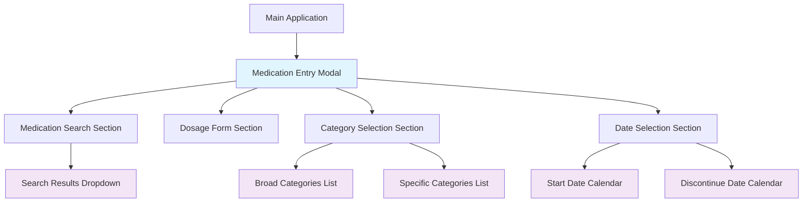

# Testing Strategies and Patterns

## Table of Contents

- [Overview](#overview)
- [Data Modal ID Pattern](#data-modal-id-pattern)
- [Modal Identification System](#modal-identification-system)
- [E2E Testing with Playwright](#e2e-testing-with-playwright)
- [Testing Benefits](#testing-benefits)
- [Implementation Examples](#implementation-examples)
- [Best Practices](#best-practices)

## Overview

The A4C-FrontEnd project employs a comprehensive testing strategy that emphasizes end-to-end testing with Playwright, accessibility validation, and robust modal identification patterns. The testing architecture is designed to be maintainable, reliable, and comprehensive across multiple browsers and devices.

## Data Modal ID Pattern

### Purpose and Implementation

The `data-modal-id` attribute serves as a crucial testing identifier pattern throughout the application. This pattern provides stable, semantic identifiers for UI elements that persist across code refactoring and styling changes.

### Core Implementation

```typescript
// Component implementation pattern
<div data-modal-id="add-new-prescribed-medication">
  <div data-modal-id="medication-search-results">
    {/* Modal content */}
  </div>
</div>
```

### Usage in Components

The pattern is implemented in key components throughout the application:

**Autocomplete Dropdown Component**
```typescript
// src/components/ui/autocomplete-dropdown.tsx
<div
  {...(modalId && { 'data-modal-id': modalId })}
  className="dropdown-container"
>
  {/* Dropdown content */}
</div>
```

**Medication Entry Modal**
```typescript
// src/views/medication/MedicationEntryModalRefactored.tsx
<div
  data-modal-id="add-new-prescribed-medication"
  className="modal-container"
>
  {/* Modal content */}
</div>
```

### Benefits for Testing

1. **Stability**: Identifiers remain constant even when CSS classes or DOM structure changes
2. **Semantic Meaning**: Clear, descriptive names that indicate component purpose
3. **Easy Maintenance**: Simple to update and manage across large codebases
4. **Cross-Browser Consistency**: Works reliably across different browsers and environments

## Modal Identification System

### Current Modal Hierarchy

The application currently identifies **15 modal-like elements** using the `data-modal-id` pattern:

#### Primary Modals
1. **`medication-entry`** - Main medication entry modal container
2. **`medication-search-results`** - Medication search dropdown results

#### Category Selection Modals
3. **`broad-categories-list`** - Broad category selection dropdown
4. **`specific-categories-list`** - Specific category selection dropdown

#### Date Selection Modals
5. **`start-date-calendar`** - Start date calendar popup
6. **`discontinue-date-calendar`** - Discontinue date calendar popup

#### Form Control Modals
Additional modal identifiers are implemented across various form controls and dropdown components throughout the medication entry workflow.

### Modal Architecture Pattern



## E2E Testing with Playwright

### Test Structure and Organization

The testing suite is organized into **9 major categories** covering **172 test cases**:

1. **Functional Testing (TC001-TC067)** - Core application functionality
2. **UI/UX Testing (TC068-TC084)** - User interface and experience validation
3. **Cross-Browser Testing (TC085-TC094)** - Multi-browser compatibility
4. **Mobile Responsive Testing (TC095-TC109)** - Mobile and tablet layouts
5. **Accessibility Testing (TC110-TC126)** - WCAG compliance and screen reader support
6. **Performance Testing (TC127-TC138)** - Load times and interaction performance
7. **Edge Cases & Boundary Testing (TC139-TC155)** - Input validation and limits
8. **Integration Testing (TC156-TC165)** - Component interaction validation
9. **Security Testing (TC166-TC172)** - XSS prevention and input sanitization

### Helper Class Pattern

```typescript
class MedicationEntryHelper {
  constructor(private page: Page) {}

  async selectClient(clientId: string = 'CLIENT001') {
    await this.page.waitForSelector('[data-testid="client-selector"]');
    await this.page.click(`[data-testid="client-${clientId}"]`);
    await this.page.waitForSelector('text=Medication Management');
  }

  async openMedicationModal() {
    await this.page.click('text=Add Medication');
    await this.page.waitForSelector('text=Select Medication Type');
    await this.page.click('text=Prescribed Medication');
    await this.page.waitForSelector('text=Add New Prescribed Medication');
  }

  async searchMedication(medicationName: string) {
    const searchInput = this.page.locator('[data-testid="medication-search"]');
    await searchInput.fill(medicationName);
    await this.page.waitForTimeout(500); // Wait for debounced search
  }
}
```

### Modal-Specific Testing Patterns

**Testing Modal Visibility and Interaction**
```typescript
test('Modal identification and interaction', async ({ page }) => {
  const helper = new MedicationEntryHelper(page);
  await helper.navigateToApp();
  await helper.selectClient();
  await helper.openMedicationModal();
  
  // Test primary modal
  await expect(page.locator('[data-modal-id="add-new-prescribed-medication"]')).toBeVisible();
  
  // Test nested modal interactions
  await helper.searchMedication('Aspirin');
  const searchResults = page.locator('[data-modal-id="medication-search-results"]');
  
  if (await searchResults.isVisible()) {
    await expect(searchResults).toContainText('Aspirin');
  }
});
```

**Cross-Browser Modal Testing**
```typescript
test('Cross-browser modal functionality', async ({ page, browserName }) => {
  await helper.navigateToApp();
  await helper.selectClient();
  await helper.openMedicationModal();
  
  // Browser-specific modal behavior
  const modal = page.locator('[data-modal-id="add-new-prescribed-medication"]');
  await expect(modal).toBeVisible();
  
  if (browserName === 'webkit') {
    // Safari-specific modal tests
    await expect(modal).toHaveCSS('position', 'fixed');
  }
  
  console.log(`Modal test completed successfully on ${browserName}`);
});
```

## Testing Benefits

### Reliability and Maintainability
- **Stable Identifiers**: `data-modal-id` attributes provide consistent targeting across refactors
- **Semantic Naming**: Clear, descriptive identifiers improve test readability
- **Separation of Concerns**: Testing identifiers separate from styling classes

### Comprehensive Coverage
- **Multi-Browser Support**: Automated testing across Chrome, Firefox, and Safari
- **Device Testing**: Mobile and tablet responsive testing
- **Accessibility Validation**: Built-in WCAG compliance checking
- **Performance Monitoring**: Load time and interaction performance validation

### Development Workflow Integration
- **CI/CD Integration**: Automated test execution in continuous integration
- **Visual Regression Testing**: Screenshot comparison for UI consistency
- **Parallel Execution**: Multiple browser testing in parallel for faster feedback

## Implementation Examples

### Basic Modal Testing

```typescript
test('Basic modal interaction flow', async ({ page }) => {
  const helper = new MedicationEntryHelper(page);
  
  // Navigation and setup
  await helper.navigateToApp();
  await helper.selectClient();
  
  // Modal opening
  await helper.openMedicationModal();
  await expect(page.locator('[data-modal-id="add-new-prescribed-medication"]')).toBeVisible();
  
  // Form interaction
  await helper.searchMedication('Lorazepam');
  await page.waitForTimeout(1000);
  
  // Verify search results modal
  const resultsModal = page.locator('[data-modal-id="medication-search-results"]');
  if (await resultsModal.isVisible()) {
    await expect(resultsModal).toContainText('Lorazepam');
  }
});
```

### Accessibility Testing Pattern

```typescript
test('Modal accessibility compliance', async ({ page }) => {
  await helper.navigateToApp();
  await helper.selectClient();
  await helper.openMedicationModal();
  
  // ARIA compliance checks
  const modal = page.locator('[data-modal-id="add-new-prescribed-medication"]');
  await expect(modal).toHaveAttribute('role', 'dialog');
  await expect(modal).toHaveAttribute('aria-modal', 'true');
  
  // Keyboard navigation testing
  await page.keyboard.press('Tab');
  const focusedElement = page.locator(':focus');
  await expect(focusedElement).toBeVisible();
  
  // Screen reader compatibility
  const headings = page.locator('h1, h2, h3');
  await expect(headings).toHaveCount({ min: 1 });
});
```

### Performance Testing Pattern

```typescript
test('Modal performance validation', async ({ page }) => {
  const startTime = Date.now();
  
  await helper.navigateToApp();
  await helper.selectClient();
  
  const modalStartTime = Date.now();
  await helper.openMedicationModal();
  
  const modalLoadTime = Date.now() - modalStartTime;
  expect(modalLoadTime).toBeLessThan(2000); // Modal should open within 2 seconds
  
  // Test modal content loading performance
  await helper.searchMedication('Aspirin');
  const searchStartTime = Date.now();
  
  await page.waitForSelector('[data-modal-id="medication-search-results"]', { timeout: 3000 });
  const searchTime = Date.now() - searchStartTime;
  expect(searchTime).toBeLessThan(3000);
});
```

## Best Practices

### Test Organization
- **Helper Classes**: Use helper classes to encapsulate common test operations
- **Page Object Pattern**: Organize selectors and interactions into reusable objects
- **Test Data Management**: Centralize test data and mock responses
- **Parallel Execution**: Structure tests for safe parallel execution

### Selector Strategies
- **Prefer `data-testid`**: Use `data-testid` for primary element identification
- **Use `data-modal-id`**: Leverage `data-modal-id` for modal-specific testing
- **Avoid CSS Selectors**: Minimize dependency on CSS classes for test stability
- **Semantic Selectors**: Use text content and ARIA attributes when appropriate

### Error Handling and Debugging
- **Screenshot on Failure**: Automatic screenshot capture for failed tests
- **Comprehensive Logging**: Log test progression and browser-specific behavior
- **Timeout Management**: Appropriate timeouts for different interaction types
- **Retry Strategies**: Implement smart retry logic for flaky operations

### Performance Considerations
- **Efficient Waiting**: Use appropriate wait strategies (`waitForSelector`, `waitForTimeout`)
- **Resource Optimization**: Clean up resources and close unused browser contexts
- **Parallel Test Execution**: Structure tests to run safely in parallel
- **CI/CD Integration**: Optimize for fast feedback in continuous integration environments

---

This testing strategy ensures robust, maintainable, and comprehensive test coverage across all aspects of the A4C-FrontEnd application, with particular emphasis on modal interactions and cross-browser compatibility.