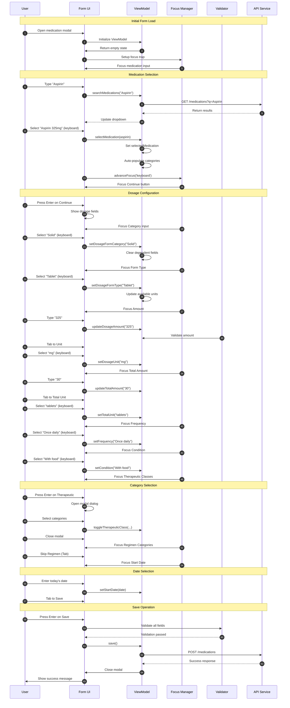
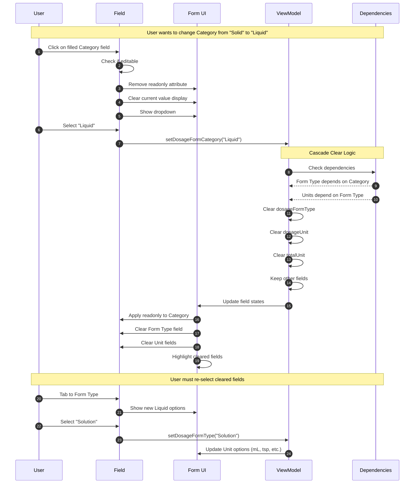
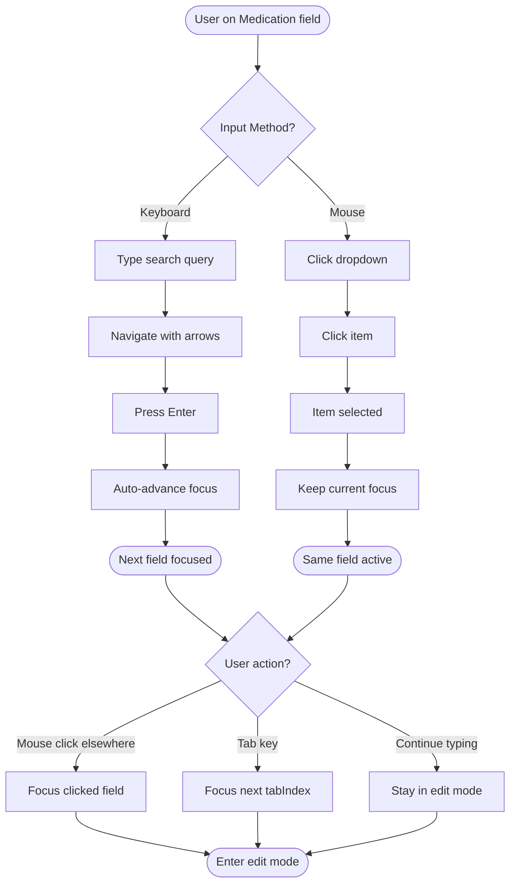
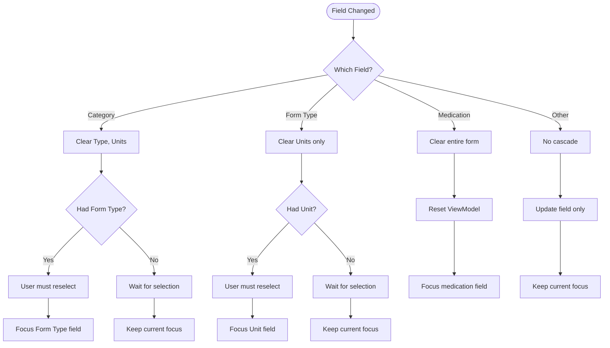
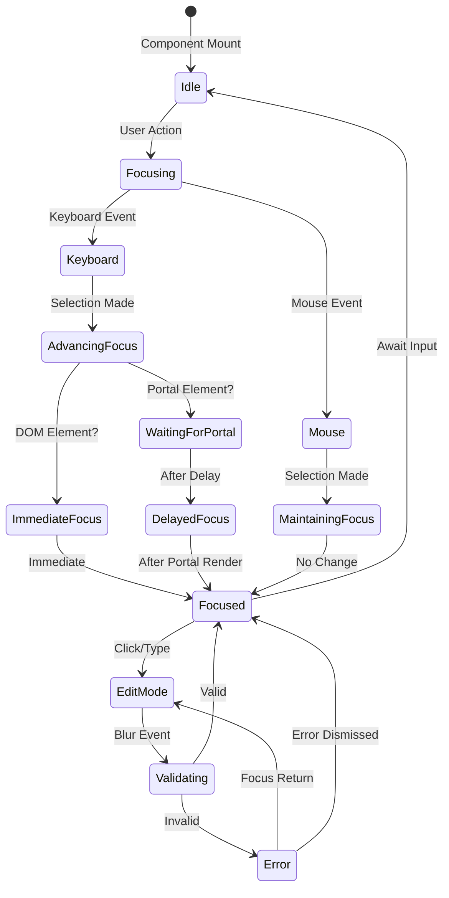
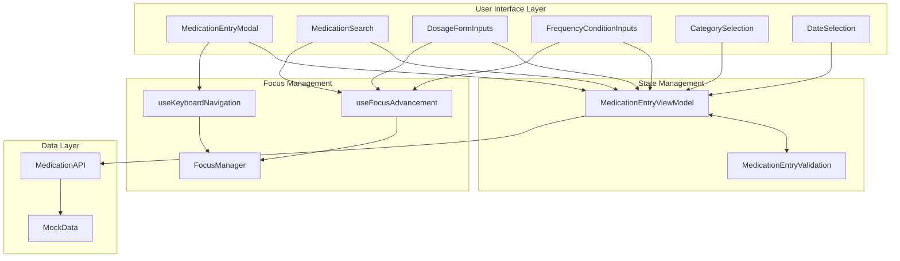
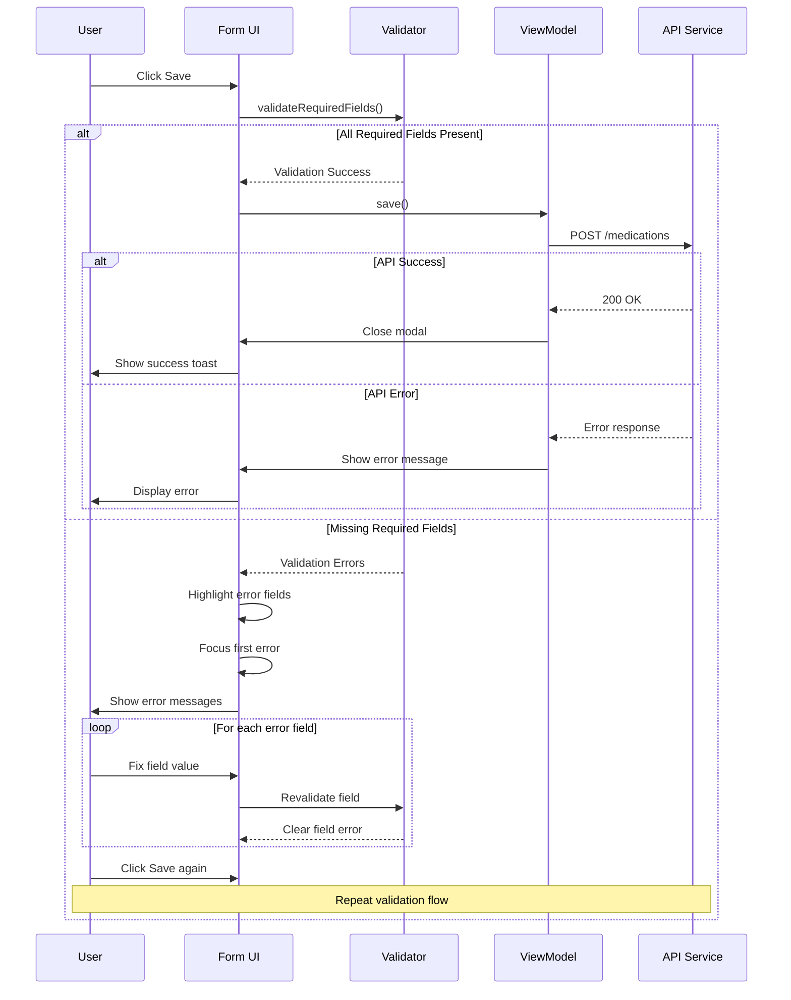
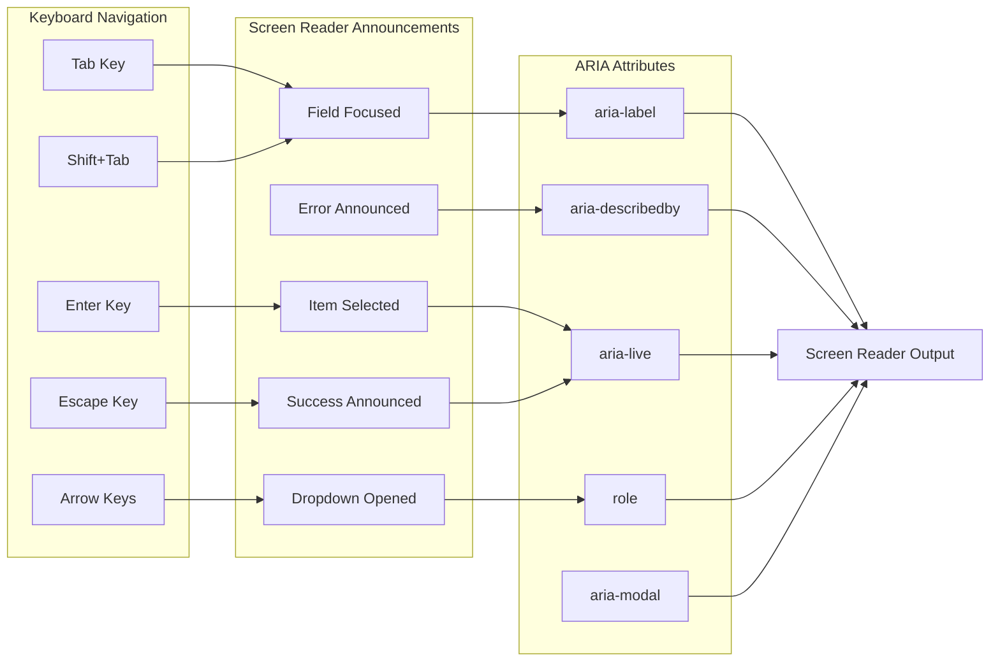
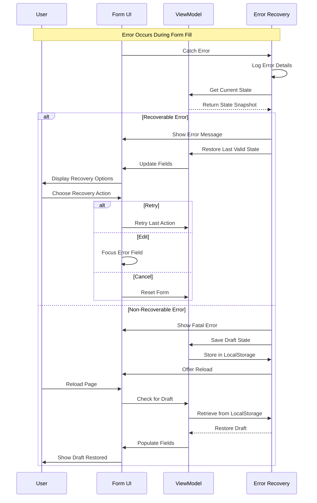
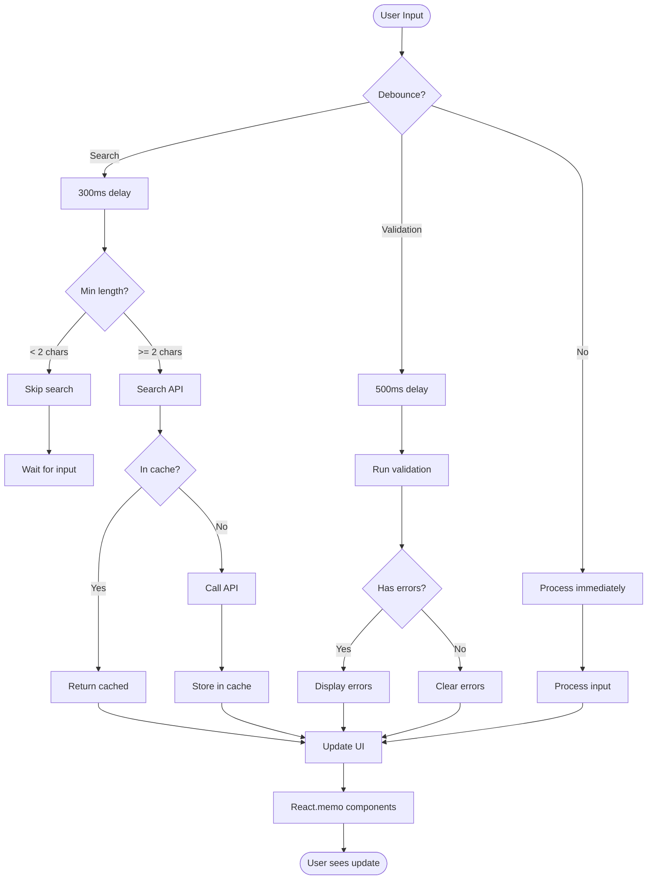

# Medication Entry Form - Detailed Sequence Diagrams

## Overview
This document provides detailed sequence and flow diagrams for the medication entry form UX redesign, illustrating all interaction patterns, state transitions, and data flows.

## 1. Complete User Journey - Happy Path

## 2. Field Editing Flow - Changing Existing Values

## 3. Mixed Input Method Flow

## 4. Cascade Clear Decision Tree

## 5. Focus Management State Machine

## 6. Component Communication Flow

## 7. Save Validation Flow

## 8. Accessibility Flow

## 9. Error Recovery Flow

## 10. Performance Optimization Flow

## Implementation Priority

1. **Phase 1**: Core field editability and cascade logic
2. **Phase 2**: Focus management and navigation patterns
3. **Phase 3**: Validation and error handling
4. **Phase 4**: Performance optimizations
5. **Phase 5**: Accessibility enhancements

## Testing Coverage Requirements

- Unit tests for each sequence flow
- Integration tests for complete journeys
- E2E tests for critical paths
- Performance tests for large datasets
- Accessibility tests for WCAG compliance

## Monitoring Points

Each sequence diagram indicates key monitoring points for:
- User interaction metrics
- Performance bottlenecks
- Error rates and types
- Accessibility violations
- Focus management issues