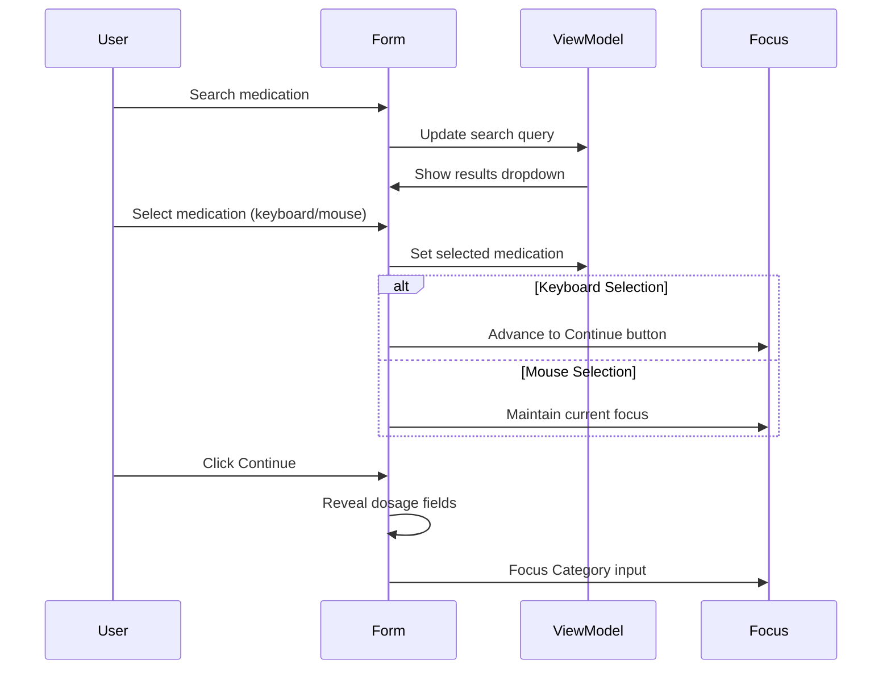
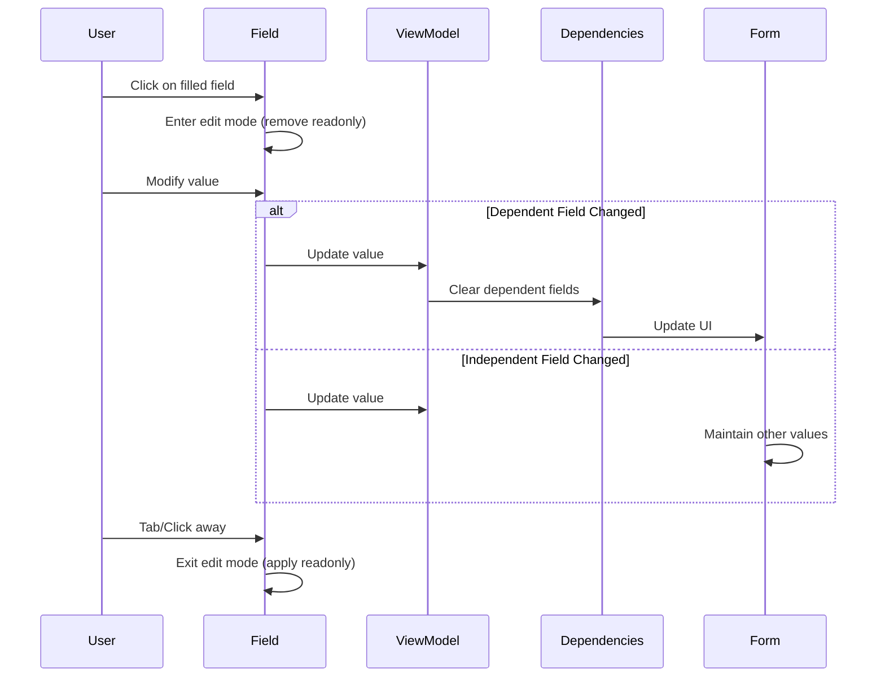
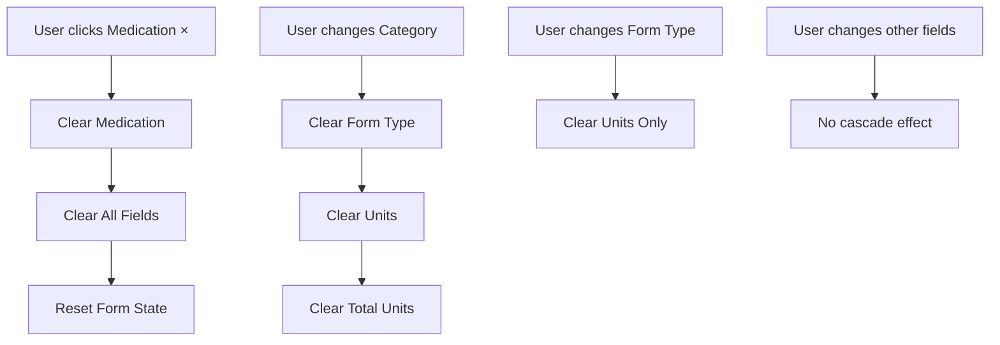
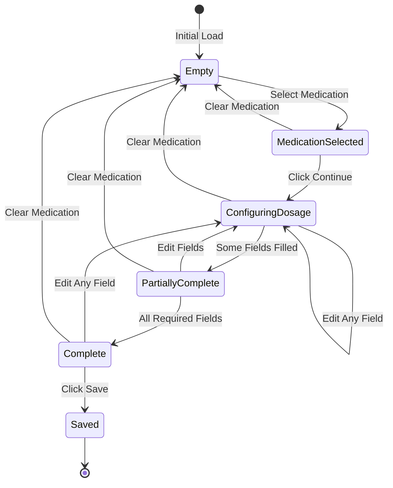
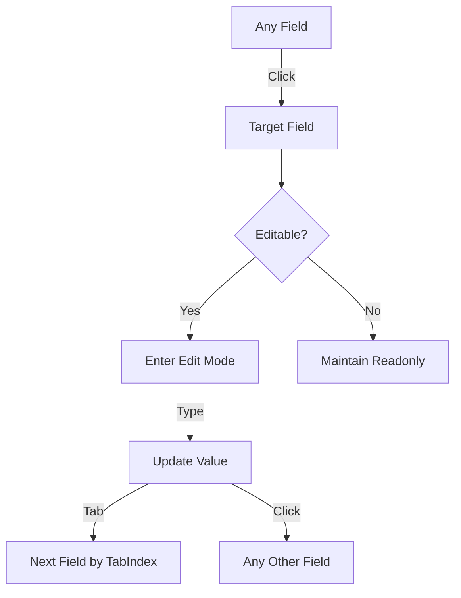

# Medication Entry Form - UX Redesign Documentation

## Executive Summary

This document outlines the comprehensive UX redesign for the medication entry form, implementing a cascading field flow that allows all fields to remain editable throughout the medication entry lifecycle. The only reset mechanism is the medication clear (×) button, which triggers a cascade clear of all dependent fields.

## Key Design Principles

### 1. Persistent Editability
- All fields remain editable after selection
- Users can modify any field at any point in the form lifecycle
- Changes cascade to dependent fields automatically

### 2. Smart Field Dependencies
- Category changes clear: Form Type, Units, Total Units
- Form Type changes clear: Units only
- Medication clear (×) resets entire form
- Other fields maintain values unless explicitly dependent

### 3. Selection Method Awareness
- Keyboard selections auto-advance focus
- Mouse selections maintain current focus
- Mixed input methods supported seamlessly

## Field Dependency Hierarchy

```
Medication (root)
├── Dosage Form Category
│   ├── Form Type (e.g., Tablet, Capsule)
│   │   └── Dosage Unit (e.g., mg, g)
│   └── Total Unit (same as Dosage Unit)
├── Dosage Amount (independent)
├── Total Amount (independent)
├── Frequency (independent)
├── Condition (independent)
├── Therapeutic Classes (independent)
├── Regimen Categories (independent)
├── Start Date (independent)
└── Discontinue Date (independent)
```

## Complete Field Flow

### Sequential Navigation Order (TabIndex)

1. **Medication Search** (tabIndex: 1)
   - Input field for medication name
   - Clear (×) button appears when medication selected

2. **Continue Button** (tabIndex: 5)
   - Enabled only when medication selected
   - Reveals dosage configuration fields

3. **Dosage Form Category** (tabIndex: 6)
   - Dropdown: Solid, Liquid, Topical/Local, etc.
   - Button (tabIndex: 7)

4. **Form Type** (tabIndex: 8)
   - Depends on Category selection
   - Button (tabIndex: 9)

5. **Dosage Amount** (tabIndex: 10)
   - Numeric input field

6. **Dosage Unit** (tabIndex: 11)
   - Depends on Form Type selection
   - Button (tabIndex: 12)

7. **Total Amount** (tabIndex: 10.5)
   - Numeric input field

8. **Total Unit** (tabIndex: 11.5)
   - Same options as Dosage Unit
   - Button (tabIndex: 12.5)

9. **Frequency** (tabIndex: 13)
   - Dropdown selection
   - Button (tabIndex: 14)

10. **Condition** (tabIndex: 15)
    - Dropdown selection
    - Button (tabIndex: 16)

11. **Therapeutic Classes** (tabIndex: 17)
    - Multi-select button
    - Modal dialog

12. **Regimen Categories** (tabIndex: 18)
    - Multi-select button
    - Modal dialog

13. **Start Date** (tabIndex: 19)
    - Date input with calendar
    - Calendar button (tabIndex: 20)

14. **Discontinue Date** (tabIndex: 21)
    - Date input with calendar
    - Calendar button (tabIndex: 22)

15. **Close Modal** (tabIndex: 23)

16. **Cancel** (tabIndex: 24)

17. **Save** (tabIndex: 25)

## Process Flow Diagrams

### 1. Initial Entry Flow



### 2. Field Editing Flow (Post-Selection)



### 3. Cascade Clear Flow



## State Machine Diagram



## Navigation Patterns

### Keyboard Navigation (Tab/Shift+Tab)

```mermaid
flowchart LR
    A[Medication] -->|Tab| B[Continue]
    B -->|Tab| C[Category]
    C -->|Tab| D[Category Button]
    D -->|Tab| E[Form Type]
    E -->|Tab| F[Form Type Button]
    F -->|Tab| G[Amount]
    G -->|Tab| H[Unit]
    H -->|Tab| I[Unit Button]
    I -->|Tab| J[Total Amount]
    J -->|Tab| K[Total Unit]
    K -->|Tab| L[Total Unit Button]
    L -->|Tab| M[Frequency]
    M -->|Tab| N[Frequency Button]
    N -->|Tab| O[Condition]
    O -->|Tab| P[Condition Button]
    P -->|Tab| Q[Therapeutic]
    Q -->|Tab| R[Regimen]
    R -->|Tab| S[Start Date]
    S -->|Tab| T[End Date]
    T -->|Tab| U[Save]
    U -->|Tab| A
```



### Mouse Navigation (Mixed Mode)



## Implementation Strategy

### Phase 1: Field Editability
1. Remove all `disabled` attributes
2. Implement dynamic `readonly` toggle
3. Add click handlers for edit mode entry
4. Maintain tabIndex consistency

### Phase 2: Cascade Logic
1. Implement dependency tracking
2. Add cascade clear methods
3. Update ViewModel field setters
4. Test all dependency paths

### Phase 3: Focus Management
1. Update `useFocusAdvancement` hook
2. Implement edit mode focus handling
3. Add focus restoration on edit cancel
4. Test keyboard/mouse combinations

### Phase 4: Visual Feedback
1. Style readonly vs editable states
2. Add edit mode indicators
3. Implement field validation feedback
4. Add cascade clear animations

## Component Updates Required

### 1. MedicationSearch Component
```typescript
// Add clear button to medication input
// Implement cascade clear on medication change
// Maintain search functionality in edit mode
```

### 2. DosageFormInputs Component
```typescript
// Remove disabled logic
// Add readonly toggle on click
// Implement cascade clear for dependencies
// Maintain dropdown state in edit mode
```

### 3. FrequencyConditionInputs Component
```typescript
// Remove disabled attributes
// Add edit mode entry on click
// Maintain independent values
```

### 4. CategorySelection Component
```typescript
// Keep multi-select always accessible
// Add visual indicator for selections
// No cascade effects
```

### 5. DateSelection Component
```typescript
// Keep calendar always accessible
// Add clear button for dates
// No cascade effects
```

## Focus Advancement Rules

### Keyboard Selection
- Always advance to next logical field
- Use TIMINGS.focus.transitionDelay for Portal elements
- Skip readonly fields in tab order

### Mouse Selection
- Never auto-advance focus
- Maintain current field focus
- Allow immediate editing

### Mixed Input
- Track last interaction method
- Apply appropriate focus behavior
- Support seamless transitions

## Validation Strategy

### Real-time Validation
- Validate on blur
- Show errors immediately
- Clear errors on valid input

### Save Validation
- Check all required fields
- Highlight missing fields
- Focus first error field

### Cascade Validation
- Re-validate affected fields
- Clear errors for cleared fields
- Maintain valid field states

## Accessibility Considerations

1. **ARIA Labels**: All fields properly labeled
2. **Error Announcements**: Screen reader friendly
3. **Focus Indicators**: Clear visual focus
4. **Keyboard Support**: Full keyboard navigation
5. **Role Attributes**: Proper semantic HTML

## Testing Requirements

### Unit Tests
- Field dependency logic
- Cascade clear behavior
- Focus advancement patterns
- Validation rules

### Integration Tests
- Complete form flow
- Mixed input methods
- Field dependencies
- Save/Cancel operations

### E2E Tests
- Full user journey
- Keyboard navigation
- Mouse interactions
- Error scenarios

### UAT Scenarios
1. Complete form with keyboard only
2. Complete form with mouse only
3. Edit filled form fields
4. Test cascade clear behaviors
5. Validate save requirements

## Migration Path

### Step 1: Remove Current Restrictions
- Remove setTimeout calls
- Remove disabled attributes
- Clean up UAT logging

### Step 2: Implement New Patterns
- Add readonly toggles
- Implement cascade logic
- Update focus management

### Step 3: Test and Validate
- Run regression tests
- Perform UAT testing
- Fix edge cases

### Step 4: Deploy
- Feature flag if needed
- Monitor user behavior
- Gather feedback

## Success Metrics

1. **Reduced Form Completion Time**: Target 20% reduction
2. **Fewer Form Abandonment**: Target 15% reduction
3. **Reduced Support Tickets**: Related to form confusion
4. **Improved Accessibility Score**: WCAG AA compliance
5. **User Satisfaction**: Post-implementation survey

## Conclusion

This redesign creates a more intuitive, flexible medication entry form that respects user intent while maintaining data integrity through smart field dependencies. The implementation focuses on removing artificial restrictions while adding intelligent cascade behaviors that guide users through the form naturally.