# UI Patterns and Architecture

## Table of Contents

- [Overview](#overview)
- [Modal Architecture](#modal-architecture)
- [Focus Management Patterns](#focus-management-patterns)
- [Dropdown and Autocomplete Patterns](#dropdown-and-autocomplete-patterns)
- [Form Validation Patterns](#form-validation-patterns)
- [Accessibility Considerations](#accessibility-considerations)
- [Component Design Principles](#component-design-principles)
- [Timing and Animation Patterns](#timing-and-animation-patterns)

## Overview

The A4C-FrontEnd application follows a sophisticated UI architecture that prioritizes accessibility, maintainability, and user experience. The design emphasizes modal-based workflows, intelligent focus management, and responsive interaction patterns.

## Modal Architecture

### Single Container with Focus Contexts

Instead of traditional nested modals, the application implements a **single modal container with multiple focus contexts**:

```
Medication Entry Modal (Primary Focus Container)
├── Focus Context 1: Search/Selection Phase
├── Focus Context 2: Form Input Phase (structured tab order)
├── Focus Context 3: Transient Overlays (temporary focus trap)
└── Focus Context 4: Action Phase (Save/Cancel)
```

### Modal Hierarchy Structure

```mermaid
graph TD
    A[Main Application] --> B["Medication Entry Modal<br/>(data-modal-id='medication-entry')"]
    
    B --> C[Medication Search Section]
    B --> D[Dosage Form Section]
    B --> E[Category Selection Section]
    B --> F[Date Selection Section]
    
    C --> G["Search Results Dropdown<br/>(data-modal-id='medication-search-results')"]
    C --> H[Search Input Field]
    C --> I[Selected Medication Display]
    C --> J[Clear Button]
    
    D --> K[Dosage Form Category Dropdown]
    D --> L[Form Type Dropdown]
    D --> M[Dosage Amount Input]
    D --> N[Dosage Unit Dropdown]
    D --> O[Total Amount Input]
    D --> P[Total Unit Dropdown]
    D --> Q[Frequency Dropdown]
    D --> R[Condition Dropdown]
    
    E --> S["Broad Categories List<br/>(data-modal-id='broad-categories-list')"]
    E --> T["Specific Categories List<br/>(data-modal-id='specific-categories-list')"]
    
    F --> U["Start Date Calendar<br/>(data-modal-id='start-date-calendar')"]
    F --> V["Discontinue Date Calendar<br/>(data-modal-id='discontinue-date-calendar')"]
    
    style B fill:#e1f5fe
    style G fill:#f3e5f5
    style S fill:#f3e5f5
    style T fill:#f3e5f5
    style U fill:#f3e5f5
    style V fill:#f3e5f5
```



### Modal Design Principles

1. **Single Primary Container**: One main modal handles the entire medication entry workflow
2. **Embedded Sections**: Form sections are embedded within the primary modal
3. **Transient Overlays**: Dropdowns and calendars create temporary focus traps
4. **Clear Visual Hierarchy**: Consistent spacing and visual relationships

### Problems Avoided with This Architecture

**Traditional Nested Modal Problems:**
- Focus management complexity with multiple modal layers
- Keyboard navigation ambiguity (unclear Escape key behavior)
- Z-index management issues
- Screen reader accessibility barriers
- Mobile usability constraints
- User confusion with navigation context loss

## Focus Management Patterns

### Tab Order Implementation Strategy

The application uses a **hybrid approach** for tab order management:

#### Current Tab Order Issues
- Elements without explicit `tabIndex` fall back to DOM order
- Mixing numbered and unnumbered elements creates unexpected sequences
- Browser handles tab order as: positive tabIndex (1,2,3...) → elements without tabIndex → negative tabIndex

#### Recommended Implementation Approaches

**Option 1: Comprehensive tabIndex Assignment**
```typescript
// Explicit tab order for all interactive elements
const TAB_ORDER = {
  SEARCH_SECTION: { start: 1, end: 2 },
  FORM_FIELDS: { start: 3, end: 14 },
  CATEGORIES: { start: 15, end: 16 },
  DATES: { start: 17, end: 18 },
  ACTIONS: { start: 19, end: 20 }
};
```

**Option 2: Natural DOM Order**
```typescript
// Remove all tabIndex attributes, rely on DOM structure
<input name="search" /> {/* tabIndex omitted */}
<input name="dosage" /> {/* tabIndex omitted */}
<button>Save</button>   {/* tabIndex omitted */}
```

**Option 3: Hybrid Approach (Current)**
```typescript
// Use tabIndex only for non-DOM order elements
<input name="search" tabIndex={1} />
<input name="dosage" />              {/* DOM order */}
<button tabIndex={2}>Save</button>
```

### Focus Flow Principles

1. **Linear Progression**: Main form follows predictable top-to-bottom, left-to-right flow
2. **Temporary Diversion**: Dropdowns/calendars create temporary focus traps
3. **Return Path**: Closing overlays returns focus to trigger element
4. **Escape Hierarchy**: Escape closes deepest overlay first, then modal

### Focus Management Rules

**Within Main Modal:**
- Tab cycles through all focusable elements
- Shift+Tab reverses direction
- Tab from last element wraps to first (if focus trapped)

**Within Dropdowns/Overlays:**
- Opening dropdown moves focus into it
- Tab/Arrow keys navigate options
- Enter selects option and closes
- Escape closes without selection
- Focus returns to trigger element on close

**Edge Case Handling:**
- Disabled fields are skipped in tab order
- Hidden elements never receive focus
- Dynamic content changes preserve focus position
- Loading states announce to screen readers

## Dropdown and Autocomplete Patterns

### Centralized Timing Configuration

All dropdown interactions use centralized timing from `/src/config/timings.ts`:

```typescript
export const TIMINGS = {
  dropdown: {
    // Standard UX pattern: 200ms in production, 0ms in tests
    closeDelay: isTestEnvironment ? 0 : 200
  },
  scroll: {
    // DOM update delay: 100ms in production, 0ms in tests
    animationDelay: isTestEnvironment ? 0 : 100
  }
};
```

### useDropdownBlur Hook Pattern

```typescript
// Standard dropdown blur implementation
const [showDropdown, setShowDropdown] = useState(false);
const handleBlur = useDropdownBlur(setShowDropdown);

return (
  <input
    onBlur={handleBlur}
    onFocus={() => setShowDropdown(true)}
  />
);
```

### Autocomplete Component Implementation

```typescript
interface AutocompleteDropdownProps {
  modalId?: string;
  items: AutocompleteItem[];
  onSelect: (item: AutocompleteItem) => void;
  // ... other props
}

export const AutocompleteDropdown: React.FC<AutocompleteDropdownProps> = ({
  modalId,
  items,
  onSelect,
  // ... other props
}) => {
  return (
    <div
      {...(modalId && { 'data-modal-id': modalId })}
      className="autocomplete-dropdown"
      role="listbox"
      aria-label="Search results"
    >
      {items.map((item, index) => (
        <div
          key={item.id}
          role="option"
          aria-selected={index === selectedIndex}
          onClick={() => onSelect(item)}
        >
          {item.label}
        </div>
      ))}
    </div>
  );
};
```

### Search and Selection Patterns

**Debounced Search Implementation:**
```typescript
import { useDebounce } from '@/hooks/useDebounce';

const [searchQuery, setSearchQuery] = useState('');
const debouncedQuery = useDebounce(searchQuery, TIMINGS.debounce.search);

useEffect(() => {
  if (debouncedQuery) {
    performSearch(debouncedQuery);
  }
}, [debouncedQuery]);
```

## Form Validation Patterns

### Validation Architecture

The application uses a multi-layered validation approach:

1. **Input-Level Validation**: Real-time validation on individual fields
2. **Form-Level Validation**: Cross-field validation and business rules
3. **Submit Validation**: Final validation before submission
4. **Server Validation**: Backend validation with error handling

### MobX Integration Pattern

```typescript
// ViewModel with validation
export class MedicationEntryViewModel {
  @observable medication: Medication | null = null;
  @observable dosageAmount: string = '';
  @observable errors: Record<string, string> = {};

  @computed
  get isValid(): boolean {
    return Object.keys(this.errors).length === 0;
  }

  @action
  validateField(field: string, value: any): string | null {
    // Validation logic
    switch (field) {
      case 'dosageAmount':
        if (!value || isNaN(Number(value))) {
          return 'Please enter a valid dosage amount';
        }
        if (Number(value) <= 0) {
          return 'Dosage amount must be greater than zero';
        }
        return null;
      default:
        return null;
    }
  }

  @action
  setDosageAmount(value: string) {
    this.dosageAmount = value;
    const error = this.validateField('dosageAmount', value);
    if (error) {
      this.errors.dosageAmount = error;
    } else {
      delete this.errors.dosageAmount;
    }
  }
}
```

### Real-time Validation Implementation

```typescript
const DosageAmountInput: React.FC = observer(() => {
  const { medicationEntry } = useViewModel();

  return (
    <div className="form-field">
      <label htmlFor="dosage-amount">Dosage Amount</label>
      <input
        id="dosage-amount"
        type="number"
        value={medicationEntry.dosageAmount}
        onChange={(e) => medicationEntry.setDosageAmount(e.target.value)}
        className={medicationEntry.errors.dosageAmount ? 'error' : ''}
        aria-invalid={!!medicationEntry.errors.dosageAmount}
        aria-describedby={
          medicationEntry.errors.dosageAmount ? 'dosage-error' : undefined
        }
      />
      {medicationEntry.errors.dosageAmount && (
        <div
          id="dosage-error"
          className="error-message"
          role="alert"
        >
          {medicationEntry.errors.dosageAmount}
        </div>
      )}
    </div>
  );
});
```

## Accessibility Considerations

### WCAG Compliance Requirements

The application maintains **WCAG 2.1 AA** compliance through:

1. **Semantic HTML**: Proper use of form elements, headings, and landmarks
2. **ARIA Attributes**: Comprehensive labeling and state communication
3. **Keyboard Navigation**: Full keyboard accessibility support
4. **Screen Reader Support**: Clear announcements and navigation cues
5. **Color Contrast**: Sufficient contrast ratios for all text and interactive elements

### Modal Accessibility Implementation

```typescript
<div
  role="dialog"
  aria-modal="true"
  aria-labelledby="modal-title"
  aria-describedby="modal-description"
  data-modal-id="medication-entry"
>
  <h2 id="modal-title">Add New Prescribed Medication</h2>
  <p id="modal-description">
    Complete the form below to add a new medication to the client's profile.
  </p>
  
  {/* Modal content */}
  
  {/* Screen reader announcements */}
  <div className="sr-only" aria-live="polite" aria-atomic="true">
    {announcements}
  </div>
</div>
```

### Focus Trap Implementation

```typescript
const useFocusTrap = (isActive: boolean) => {
  const containerRef = useRef<HTMLDivElement>(null);

  useEffect(() => {
    if (!isActive) return;

    const container = containerRef.current;
    if (!container) return;

    const focusableElements = container.querySelectorAll(
      'button, [href], input, select, textarea, [tabindex]:not([tabindex="-1"])'
    );

    const firstElement = focusableElements[0] as HTMLElement;
    const lastElement = focusableElements[focusableElements.length - 1] as HTMLElement;

    const handleKeyDown = (e: KeyboardEvent) => {
      if (e.key === 'Tab') {
        if (e.shiftKey && document.activeElement === firstElement) {
          e.preventDefault();
          lastElement?.focus();
        } else if (!e.shiftKey && document.activeElement === lastElement) {
          e.preventDefault();
          firstElement?.focus();
        }
      }
    };

    container.addEventListener('keydown', handleKeyDown);
    firstElement?.focus();

    return () => {
      container.removeEventListener('keydown', handleKeyDown);
    };
  }, [isActive]);

  return containerRef;
};
```

### Screen Reader Announcements

```typescript
const useScreenReaderAnnouncements = () => {
  const [announcement, setAnnouncement] = useState('');

  const announce = useCallback((message: string) => {
    setAnnouncement(message);
    // Clear after screen reader has time to read
    setTimeout(() => setAnnouncement(''), 1000);
  }, []);

  return { announcement, announce };
};
```

## Component Design Principles

### Composition Over Inheritance

```typescript
// Base component with slots
interface CardProps {
  children: React.ReactNode;
  header?: React.ReactNode;
  actions?: React.ReactNode;
}

export const Card: React.FC<CardProps> = ({ children, header, actions }) => (
  <div className="card">
    {header && <div className="card-header">{header}</div>}
    <div className="card-content">{children}</div>
    {actions && <div className="card-actions">{actions}</div>}
  </div>
);

// Usage with composition
<Card
  header={<h2>Medications</h2>}
  actions={<Button>Add Medication</Button>}
>
  <MedicationList />
</Card>
```

### Compound Component Pattern

```typescript
// Compound component for complex form sections
const FormSection = ({ children }: { children: React.ReactNode }) => (
  <div className="form-section">{children}</div>
);

const FormTitle = ({ children }: { children: React.ReactNode }) => (
  <h3 className="form-title">{children}</h3>
);

const FormFields = ({ children }: { children: React.ReactNode }) => (
  <div className="form-fields">{children}</div>
);

// Export as compound component
FormSection.Title = FormTitle;
FormSection.Fields = FormFields;

// Usage
<FormSection>
  <FormSection.Title>Dosage Information</FormSection.Title>
  <FormSection.Fields>
    <DosageAmountInput />
    <DosageUnitSelect />
  </FormSection.Fields>
</FormSection>
```

### Variant-Based Component Design

Using Class Variance Authority for type-safe component variants:

```typescript
import { cva, type VariantProps } from 'class-variance-authority';

const buttonVariants = cva(
  // Base classes
  'inline-flex items-center justify-center rounded-md text-sm font-medium transition-colors focus-visible:outline-none focus-visible:ring-2 focus-visible:ring-ring focus-visible:ring-offset-2 disabled:opacity-50 disabled:pointer-events-none ring-offset-background',
  {
    variants: {
      variant: {
        default: 'bg-primary text-primary-foreground hover:bg-primary/90',
        destructive: 'bg-destructive text-destructive-foreground hover:bg-destructive/90',
        outline: 'border border-input hover:bg-accent hover:text-accent-foreground',
        secondary: 'bg-secondary text-secondary-foreground hover:bg-secondary/80',
        ghost: 'hover:bg-accent hover:text-accent-foreground',
        link: 'underline-offset-4 hover:underline text-primary',
      },
      size: {
        default: 'h-10 py-2 px-4',
        sm: 'h-9 px-3 rounded-md',
        lg: 'h-11 px-8 rounded-md',
        icon: 'h-10 w-10',
      },
    },
    defaultVariants: {
      variant: 'default',
      size: 'default',
    },
  }
);

interface ButtonProps
  extends React.ButtonHTMLAttributes<HTMLButtonElement>,
    VariantProps<typeof buttonVariants> {
  asChild?: boolean;
}

const Button = React.forwardRef<HTMLButtonElement, ButtonProps>(
  ({ className, variant, size, asChild = false, ...props }, ref) => {
    const Comp = asChild ? Slot : 'button';
    return (
      <Comp
        className={cn(buttonVariants({ variant, size, className }))}
        ref={ref}
        {...props}
      />
    );
  }
);
```

## Timing and Animation Patterns

### Centralized Timing Architecture

All timing-related behavior is centralized in `/src/config/timings.ts` to ensure:
- Consistent timing across components
- Test-friendly 0ms delays in test environment
- Easy global timing adjustments

### Common Timing Patterns

**Dropdown Interactions:**
```typescript
import { useDropdownBlur } from '@/hooks/useDropdownBlur';

// Standard 200ms delay for dropdown closure
const handleBlur = useDropdownBlur(setShowDropdown);
```

**Scroll Animations:**
```typescript
import { useScrollToElement } from '@/hooks/useScrollToElement';

// 100ms delay for DOM updates before scroll
const scrollToElement = useSimpleScrollToElement();

// Trigger scroll after content updates
useEffect(() => {
  if (showDropdown) {
    scrollToElement('dropdown-container');
  }
}, [showDropdown, scrollToElement]);
```

**Debounced Inputs:**
```typescript
import { useDebounce } from '@/hooks/useDebounce';

// 500ms debounce for search inputs
const debouncedSearchQuery = useDebounce(searchQuery, TIMINGS.debounce.search);

// 300ms debounce for general inputs
const debouncedValue = useDebounce(inputValue, TIMINGS.debounce.default);
```

### Animation Best Practices

1. **Test Environment**: All animations disabled in test environment
2. **Reduced Motion**: Respect user's reduced motion preferences
3. **Progressive Enhancement**: Animations enhance but don't break functionality
4. **Performance**: Use CSS transforms and opacity for smooth animations

---

This UI architecture creates a cohesive, accessible, and maintainable user interface that prioritizes user experience while supporting complex healthcare workflows.